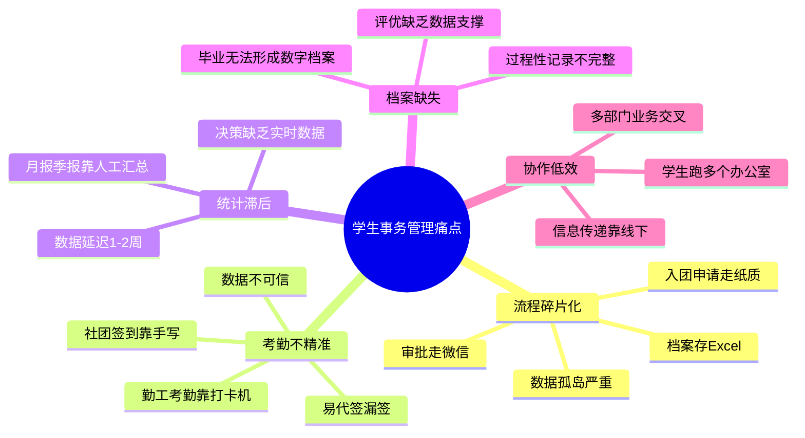
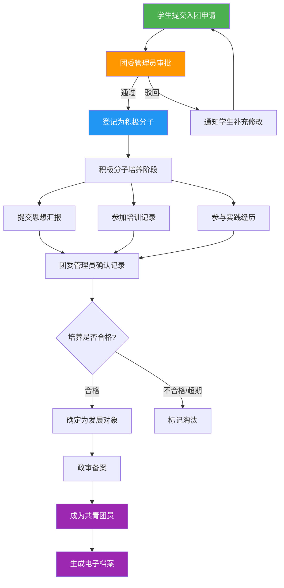
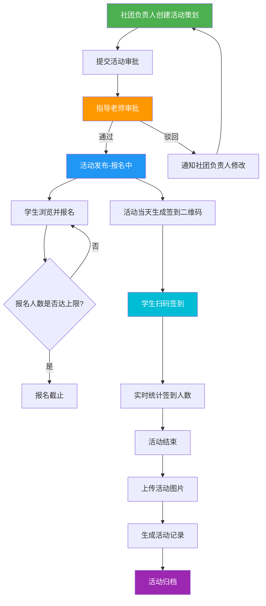
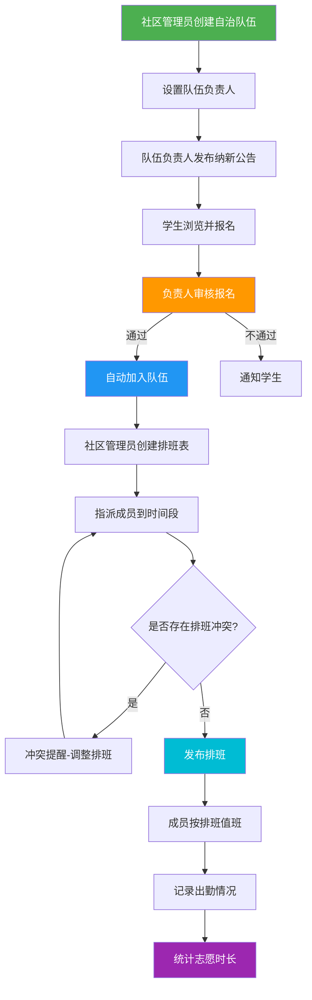
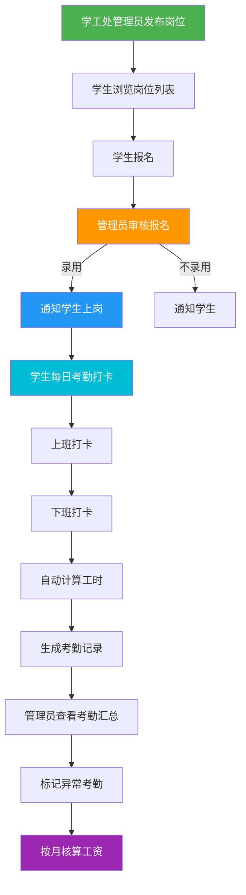
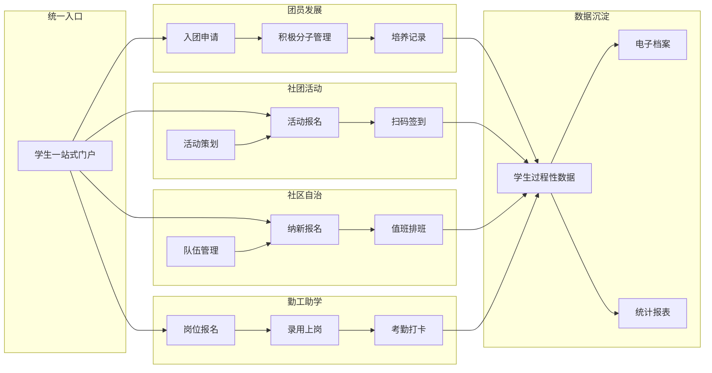
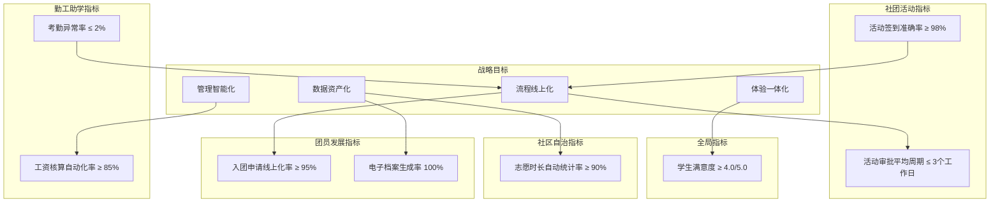
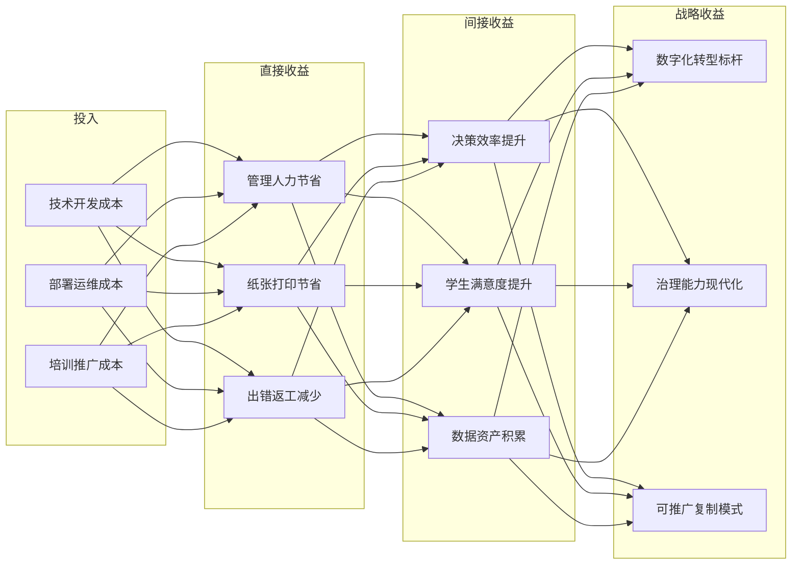

# 业务需求文档（BRD）— 学生"一站式"自主管理过程管理系统

> 文档版本：v1.0 | 创建日期：2026-06-05 | 状态：评审中
> 业务发起方：团委/学工处 | 文档来源：02-prd.md

---

## 一、业务背景

### 1.1 宏观环境

教育部持续推进高校治理数字化转型，明确要求学生管理过程可追溯、数据可分析。国务院《关于加强数字政府建设的指导意见》与教育部《教育信息化2.0行动计划》为高校学生事务数字化提供了政策依据和方向指引。高校数字化治理已从"可选项"转变为"必选项"。

### 1.2 行业现状

当前国内高校学生事务管理普遍存在以下特征：

- **线下为主**：入团申请、社团审批、勤工助学等核心业务仍以纸质表单为主要载体
- **系统割裂**：各部门独立使用Excel、微信、钉钉等工具，缺乏统一数据平台
- **数据断层**：学生四年过程性数据分散存储，毕业时无法形成完整数字档案
- **协作低效**：跨部门业务依赖线下会议和群消息传递，响应速度慢

### 1.3 本校现状

本校学生事务管理覆盖四大核心业务域：

| 业务域 | 管理部门 | 核心业务量 | 当前工具 |
|--------|----------|------------|----------|
| 团员发展 | 校团委 | 每学期200+入团申请 | 纸质表单+Excel台账 |
| 社团活动 | 社团指导中心 | 50+社团、月均100+活动 | 微信群+手写签到 |
| 社区自治 | 社区辅导员 | 20+自治队伍 | 微信接龙+纸质排班表 |
| 勤工助学 | 学工处 | 500+岗位、1000+在岗学生 | 打卡机+Excel核算 |

### 1.4 业务发起动因

1. **政策合规**：教育数字化转型要求管理过程数字化、可追溯
2. **管理不可持续**：纯人工管理模式下，业务量增长与管理资源不匹配
3. **用户诉求强烈**：数字原生代学生对线上化服务有天然期待
4. **技术可行**：Vue3 + Go + SQLite技术栈可低成本快速交付MVP

---

## 二、当前痛点

### 2.1 痛点全景

### 2.2 痛点详析

| 痛点ID | 痛点描述 | 受影响角色 | 发生频率 | 业务影响 | 严重度 |
|--------|----------|------------|----------|----------|--------|
| P1 | 入团申请需提交纸质表单，审批进度靠微信追问 | 学生、团委管理员 | 高 | 审批周期长，进度不透明 | 高 |
| P2 | 积极分子培养记录散落在Excel和纸质笔记本中 | 团委管理员 | 高 | 培养过程不可追溯，数据易丢失 | 高 |
| P3 | 社团活动策划需打印后送指导老师签字 | 社团负责人 | 中 | 活动筹备周期长，效率低 | 中 |
| P4 | 活动签到采用手写签到表，存在代签现象 | 社团负责人、学生 | 高 | 参与数据不可信，统计失真 | 高 |
| P5 | 学生需在不同办公室办理不同事务 | 普通学生 | 高 | 学生体验差，时间成本高 | 中 |
| P6 | 勤工助学岗位信息通过群消息发布，容易遗漏 | 学生、学工处管理员 | 中 | 信息触达率低，岗位匹配效率差 | 中 |
| P7 | 勤工考勤数据分散在打卡机，导出统计耗时 | 学工处管理员 | 高 | 工资核算效率低，易出错 | 高 |
| P8 | 社区值班排班靠微信群接龙，冲突频发 | 社区管理员、自治队伍 | 中 | 排班混乱，值班空缺 | 中 |
| P9 | 志愿时长审核靠纸质证明，核查困难 | 社区管理员、学生 | 中 | 时长数据不可信 | 高 |
| P10 | 各类统计报表靠人工汇总，数据延迟1-2周 | 团委/学工处管理员 | 高 | 管理决策滞后 | 高 |

### 2.3 痛点根因分析

| 根因 | 导致的痛点 | 本质问题 |
|------|------------|----------|
| 缺乏统一平台 | P1, P3, P5, P6 | 各业务独立运行，无"一站式"入口 |
| 数据非结构化 | P2, P9, P10 | 数据分散在不同载体，无法统一管理和分析 |
| 人工操作环节多 | P1, P3, P7, P8, P10 | 流程中大量重复性人工操作，效率低易出错 |
| 身份验证手段弱 | P4, P9 | 纸质签到和证明无法有效防伪 |
| 信息传递靠线下 | P1, P3, P5, P6, P8 | 沟通成本高，信息不对称 |

---

## 三、业务流程

### 3.1 团员发展业务流程

**业务说明**：

1. 学生在线填写入团申请表（含基本信息、申请理由）
2. 团委管理员在线审批，可填写审批意见
3. 审批通过后系统自动创建积极分子记录
4. 积极分子培养阶段，可记录思想汇报、培训记录、实践经历
5. 培养合格后进入发展对象阶段，经政审备案后成为正式团员
6. 全过程数据自动归集，生成电子档案

### 3.2 社团活动业务流程

**业务说明**：

1. 社团负责人在线填写活动策划（名称、时间、地点、人数上限、内容、预算）
2. 提交后自动流转至指导老师审批
3. 审批通过后活动状态变为"报名中"，学生可浏览报名
4. 活动当天生成签到二维码，学生扫码签到
5. 二维码含加密签名和时效限制，防止伪造和代签
6. 活动结束后上传活动图片，形成完整活动记录

### 3.3 社区自治业务流程

**业务说明**：

1. 社区管理员维护自治队伍基本信息和组织架构
2. 队伍负责人发布纳新公告，学生在线报名
3. 审核通过后学生自动加入队伍
4. 管理员/负责人创建值班排班表，系统自动检测排班冲突
5. 成员按排班值班，系统记录出勤情况
6. 基于出勤记录自动统计志愿时长

### 3.4 勤工助学业务流程

**业务说明**：

1. 学工处管理员发布岗位信息（名称、部门、人数、薪资、要求、工作时间）
2. 学生浏览岗位列表，按条件筛选，一键报名
3. 管理员审核报名，录用后通知学生上岗
4. 在岗学生每日上下班打卡，系统自动计算工时
5. 管理员按月查看考勤汇总，标记异常，核算工资

### 3.5 全局业务流程关系

---

## 四、业务规则

### 4.1 团员发展业务规则

| 规则ID | 规则名称 | 规则描述 | 适用场景 | 异常处理 |
|--------|----------|----------|----------|----------|
| BR-L01 | 入团申请唯一性 | 每位学生仅可提交一次入团申请 | 学生提交申请时 | 已有申请记录时提示"您已提交入团申请" |
| BR-L02 | 驳回可重申 | 入团申请被驳回后可重新提交 | 团委管理员驳回后 | 重新提交时保留上次填写内容 |
| BR-L03 | 一级审批制 | MVP阶段审批采用一级审批（团委管理员直接审批） | 审批环节 | 后续迭代支持多级审批 |
| BR-L04 | 积极分子自动创建 | 入团申请审批通过后自动创建积极分子记录 | 审批通过时 | 无需手动登记 |
| BR-L05 | 培养记录仅追加 | 积极分子培养记录不可删除，仅可追加 | 添加培养记录时 | 确保培养过程可追溯 |
| BR-L06 | 思想汇报需确认 | 学生提交的思想汇报需团委管理员确认 | 学生提交思想汇报时 | 未确认的思想汇报标记为"待确认" |
| BR-L07 | 积极分子状态流转 | 培养中 → 已发展/已淘汰 | 积极分子管理 | 状态变更需记录原因 |

### 4.2 社团活动业务规则

| 规则ID | 规则名称 | 规则描述 | 适用场景 | 异常处理 |
|--------|----------|----------|----------|----------|
| BR-A01 | 活动时间校验 | 活动时间不可早于当前日期 | 创建活动策划时 | 提示"活动时间不能早于今天" |
| BR-A02 | 活动一级审批 | MVP阶段活动审批采用一级审批（指导老师直接审批） | 活动审批环节 | 后续迭代支持多级审批 |
| BR-A03 | 活动驳回可重提 | 活动被驳回后可修改重新提交 | 指导老师驳回后 | 重新提交时保留上次内容 |
| BR-A04 | 报名人数上限 | 报名人数不超过活动设定的人数上限 | 学生报名时 | 人数已满时提示"报名人数已达上限" |
| BR-A05 | 报名唯一性 | 每人每个活动仅可报名一次 | 学生报名时 | 重复报名提示"您已报名该活动" |
| BR-A06 | 可取消报名 | 活动开始前可取消报名 | 学生取消报名时 | 活动已开始后不可取消 |
| BR-A07 | 签到有效期 | 签到码有效期：活动开始前30分钟至活动结束 | 签到时 | 超出有效期签到提示"签到已结束" |
| BR-A08 | 签到唯一性 | 每人每个活动仅可签到一次 | 学生签到时 | 重复签到提示"您已签到" |
| BR-A09 | 签到资格校验 | 仅已报名学生可签到 | 扫码签到时 | 未报名学生签到提示"您未报名该活动" |
| BR-A10 | 签到码刷新 | 签到二维码每15分钟刷新一次 | 二维码展示时 | 旧二维码自动失效 |

### 4.3 社区自治业务规则

| 规则ID | 规则名称 | 规则描述 | 适用场景 | 异常处理 |
|--------|----------|----------|----------|----------|
| BR-C01 | 队伍名称唯一 | 自治队伍名称不可重复 | 创建/编辑队伍时 | 提示"队伍名称已存在" |
| BR-C02 | 删除前置条件 | 删除队伍需先移除所有成员 | 删除队伍时 | 存在成员时提示"请先移除队伍成员" |
| BR-C03 | 负责人必须是成员 | 队伍负责人必须为队伍成员 | 设置负责人时 | 非成员不可设为负责人 |
| BR-C04 | 纳新自动关闭 | 纳新截止日期后自动关闭报名 | 纳新截止时间到达时 | 过期后学生不可报名 |
| BR-C05 | 录用人数限制 | 录用人数不超过纳新公告中的招聘人数 | 审核纳新报名时 | 超出人数时提示"已达招聘上限" |
| BR-C06 | 排班唯一性 | 同一时间段同一人员不可重复排班 | 创建排班时 | 冲突时自动提醒并阻止 |
| BR-C07 | 排班冲突检测 | 排班时自动检测时间冲突 | 创建/编辑排班时 | 冲突时高亮提示冲突项 |

### 4.4 勤工助学业务规则

| 规则ID | 规则名称 | 规则描述 | 适用场景 | 异常处理 |
|--------|----------|----------|----------|----------|
| BR-W01 | 在岗唯一性 | 每位学生同一时间仅可持有一个在岗岗位 | 学生报名时 | 已在岗时提示"您已有在岗岗位" |
| BR-W02 | 岗位截止日期 | 岗位可设报名截止日期 | 学生报名时 | 过期后不可报名 |
| BR-W03 | 录用人数限制 | 录用人数不超过岗位招聘人数 | 管理员录用时 | 超出时提示"已达岗位招聘上限" |
| BR-W04 | 打卡顺序 | 上班打卡后才能下班打卡 | 学生下班打卡时 | 未上班打卡时提示"请先上班打卡" |
| BR-W05 | 迟到早退标记 | 系统自动标记迟到/早退 | 打卡时间超出规定时间时 | 记录异常类型 |
| BR-W06 | 缺卡补录 | 缺卡需管理员手动补录 | 管理员补录考勤时 | 补录记录标记"管理员补录" |

### 4.5 全局业务规则

| 规则ID | 规则名称 | 规则描述 | 适用场景 |
|--------|----------|----------|----------|
| BR-G01 | 角色权限控制 | 基于RBAC的角色权限体系，用户可拥有多角色（取权限并集） | 全局 |
| BR-G02 | 密码强度 | 密码≥8位，含字母+数字 | 用户注册/修改密码时 |
| BR-G03 | 登录安全 | 登录失败5次锁定30分钟 | 用户登录时 |
| BR-G04 | JWT有效期 | 令牌有效期24小时 | 认证体系 |
| BR-G05 | 文件上传限制 | 允许格式：jpg/jpeg/png/pdf/doc/docx，单文件≤10MB | 文件上传时 |
| BR-G06 | 后端强制鉴权 | 后端接口强制RBAC校验，不信任前端权限控制 | 全局API |

---

## 五、核心指标

### 5.1 业务KPI体系

### 5.2 指标定义与计算方式

| 指标ID | 指标名称 | 计算公式 | 目标值 | 采集频率 | 数据来源 |
|--------|----------|----------|--------|----------|----------|
| KPI-L01 | 入团申请线上化率 | 线上提交申请数 / 总申请数 × 100% | ≥ 95% | 月度 | 入团申请表 |
| KPI-L02 | 电子档案生成率 | 成功生成电子档案的团员数 / 总团员数 × 100% | 100% | 学期 | 档案表 |
| KPI-A01 | 活动审批平均周期 | Σ审批通过日期-提交日期 / 审批通过数 | ≤ 3个工作日 | 月度 | 活动审批记录 |
| KPI-A02 | 活动签到准确率 | 有效签到人次 / 总签到人次 × 100% | ≥ 98% | 月度 | 签到记录 |
| KPI-C01 | 志愿时长自动统计率 | 自动统计时长 / 总志愿时长 × 100% | ≥ 90% | 学期 | 值班出勤记录 |
| KPI-W01 | 工资核算自动化率 | 自动核算工资人数 / 总在岗人数 × 100% | ≥ 85% | 月度 | 考勤记录 |
| KPI-W02 | 考勤异常率 | 异常考勤人次 / 总应考勤人次 × 100% | ≤ 2% | 月度 | 考勤记录 |
| KPI-G01 | 学生满意度 | 问卷调查满意度评分均值 | ≥ 4.0/5.0 | 学期 | 问卷系统 |

### 5.3 阶段性指标目标

| 指标 | MVP阶段（W1-W12） | 增强阶段（W13-W20） | 成熟阶段（W21-W40） |
|------|-------------------|--------------------|--------------------|
| 入团申请线上化率 | ≥ 80% | ≥ 90% | ≥ 95% |
| 活动审批平均周期 | ≤ 5个工作日 | ≤ 3个工作日 | ≤ 2个工作日 |
| 活动签到准确率 | ≥ 95% | ≥ 98% | ≥ 99% |
| 考勤异常率 | ≤ 5% | ≤ 2% | ≤ 1% |
| 学生满意度 | ≥ 3.5/5.0 | ≥ 4.0/5.0 | ≥ 4.5/5.0 |

---

## 六、数据采集要求

### 6.1 数据实体与采集规范

| 数据实体 | 采集字段 | 数据类型 | 必填 | 采集方式 | 采集频率 |
|----------|----------|----------|------|----------|----------|
| **学生** | 学号 | VARCHAR(20) | 是 | 系统导入 | 入学时 |
| | 姓名 | VARCHAR(50) | 是 | 系统导入 | 入学时 |
| | 院系 | VARCHAR(100) | 是 | 系统导入 | 入学时 |
| | 年级 | VARCHAR(10) | 是 | 系统导入 | 入学时 |
| | 联系方式 | VARCHAR(20) | 是 | 系统导入/用户补充 | 入学时 |
| **入团申请** | 申请人学号 | VARCHAR(20) | 是 | 学生填写 | 提交时 |
| | 申请理由 | TEXT | 是 | 学生填写 | 提交时 |
| | 个人简历 | TEXT | 否 | 学生填写 | 提交时 |
| | 审批状态 | ENUM | 是 | 系统生成 | 审批时 |
| | 审批意见 | TEXT | 否 | 管理员填写 | 审批时 |
| | 审批时间 | DATETIME | 是 | 系统生成 | 审批时 |
| **积极分子** | 学号 | VARCHAR(20) | 是 | 系统自动 | 审批通过时 |
| | 状态 | ENUM | 是 | 系统生成 | 状态变更时 |
| | 登记日期 | DATE | 是 | 系统生成 | 登记时 |
| **培养记录** | 积极分子ID | INT | 是 | 系统关联 | 添加时 |
| | 记录类型 | ENUM | 是 | 管理员/学生选择 | 添加时 |
| | 记录内容 | TEXT | 是 | 管理员/学生填写 | 添加时 |
| | 附件URL | VARCHAR(500) | 否 | 文件上传 | 添加时 |
| **社团活动** | 活动名称 | VARCHAR(200) | 是 | 社团负责人填写 | 创建时 |
| | 活动时间 | DATETIME | 是 | 社团负责人填写 | 创建时 |
| | 活动地点 | VARCHAR(200) | 是 | 社团负责人填写 | 创建时 |
| | 人数上限 | INT | 是 | 社团负责人填写 | 创建时 |
| | 内容描述 | TEXT | 是 | 社团负责人填写 | 创建时 |
| | 审批状态 | ENUM | 是 | 系统生成 | 审批时 |
| **签到记录** | 活动ID | INT | 是 | 系统关联 | 签到时 |
| | 学生学号 | VARCHAR(20) | 是 | 系统获取 | 签到时 |
| | 签到时间 | DATETIME | 是 | 系统生成 | 签到时 |
| | 签到方式 | ENUM | 是 | 系统记录 | 签到时 |
| **自治队伍** | 队伍名称 | VARCHAR(100) | 是 | 管理员填写 | 创建时 |
| | 所属区域 | VARCHAR(100) | 是 | 管理员填写 | 创建时 |
| | 负责人学号 | VARCHAR(20) | 是 | 管理员选择 | 创建时 |
| **纳新公告** | 队伍ID | INT | 是 | 系统关联 | 发布时 |
| | 招聘要求 | TEXT | 是 | 负责人填写 | 发布时 |
| | 招聘人数 | INT | 是 | 负责人填写 | 发布时 |
| | 截止日期 | DATE | 是 | 负责人填写 | 发布时 |
| **值班排班** | 队伍ID | INT | 是 | 系统关联 | 创建时 |
| | 排班日期 | DATE | 是 | 管理员选择 | 创建时 |
| | 时间段 | VARCHAR(50) | 是 | 管理员选择 | 创建时 |
| | 值班人员 | VARCHAR(20) | 是 | 管理员选择 | 创建时 |
| **勤工岗位** | 岗位名称 | VARCHAR(200) | 是 | 管理员填写 | 发布时 |
| | 所属部门 | VARCHAR(100) | 是 | 管理员填写 | 发布时 |
| | 招聘人数 | INT | 是 | 管理员填写 | 发布时 |
| | 薪资标准 | DECIMAL(10,2) | 是 | 管理员填写 | 发布时 |
| | 工作要求 | TEXT | 否 | 管理员填写 | 发布时 |
| **考勤记录** | 岗位ID | INT | 是 | 系统关联 | 打卡时 |
| | 学生学号 | VARCHAR(20) | 是 | 系统获取 | 打卡时 |
| | 上班时间 | DATETIME | 是 | 系统生成 | 打卡时 |
| | 下班时间 | DATETIME | 否 | 系统生成 | 打卡时 |
| | 工时 | DECIMAL(4,1) | 是 | 系统计算 | 打卡时 |
| | 异常标记 | ENUM | 否 | 系统自动/管理员标记 | 打卡时 |

### 6.2 数据质量要求

| 质量维度 | 要求 | 校验方式 |
|----------|------|----------|
| 完整性 | 必填字段缺失率 ≤ 0.1% | 提交时前端校验+后端校验 |
| 准确性 | 学号格式校验通过率 100% | 正则表达式校验 |
| 一致性 | 同一学生基本信息在各模块一致 | 以学生主表为准，关联查询 |
| 时效性 | 业务操作数据实时入库，延迟 ≤ 1秒 | 事务提交保证 |
| 唯一性 | 学号、队伍名称等唯一字段无重复 | 数据库唯一约束 |

### 6.3 数据保留与归档

| 数据类别 | 在线保留期限 | 归档方式 | 归档保留期限 |
|----------|------------|----------|------------|
| 学生基本信息 | 在校期间+毕业后5年 | SQLite备份文件 | 永久 |
| 入团申请与审批 | 在校期间+毕业后5年 | SQLite备份文件 | 永久 |
| 活动记录与签到 | 3年 | 按学年归档 | 10年 |
| 考勤记录 | 3年 | 按月归档 | 10年 |
| 排班记录 | 1年 | 按学期归档 | 5年 |
| 操作日志 | 6个月 | 日志文件归档 | 3年 |

---

## 七、业务价值分析

### 7.1 价值模型

### 7.2 效率提升量化

| 业务域 | 现状指标 | 目标指标 | 提升幅度 | 价值体现 |
|--------|----------|----------|----------|----------|
| 入团申请审批 | 平均周期2周 | ≤ 3个工作日 | 缩短70%+ | 学生等待时间大幅减少，审批效率提升 |
| 社团活动签到 | 手写签到30分钟/次 | 扫码签到5分钟/次 | 效率提升6倍 | 活动组织效率显著提升，代签现象消除 |
| 勤工工资核算 | 人工核算3天/月 | 自动核算0.5天/月 | 效率提升6倍 | 管理员工作负担减轻，核算准确率提高 |
| 统计报表生成 | 人工汇总1-2周 | 实时/按需生成 | 延迟归零 | 管理决策从"事后看"变为"实时看" |
| 志愿时长统计 | 纸质审核2周 | 自动统计即时 | 延迟归零 | 时长数据可信度提高，学生权益保障 |
| 学生事务办理 | 跑3-4个办公室 | 线上一站式 | 跑动次数归零 | 学生体验质的飞跃 |

### 7.3 成本节约分析

| 成本项 | 现状（年） | 目标（年） | 节约金额 | 说明 |
|--------|-----------|-----------|----------|------|
| 纸张打印 | ~5,000元 | ~500元 | ~4,500元 | 入团申请、活动策划、排班表等纸质材料 |
| 管理人力 | ~1.5人/年 | ~0.5人/年 | ~1人/年工资 | 审批、统计、归档等重复性工作自动化 |
| 出错返工 | ~2,000元 | ~200元 | ~1,800元 | 考勤出错、信息遗漏导致的返工 |
| 通讯费用 | ~1,000元 | ~200元 | ~800元 | 微信/短信通知替代部分线下沟通 |
| **合计** | - | - | **~1人/年+7,100元** | 保守估算，未计隐性效率收益 |

### 7.4 战略价值

| 战略维度 | 价值描述 |
|----------|----------|
| **数字化转型** | 实现学生事务管理从"纸质+人工"到"数字+智能"的根本性转变，成为校内数字化治理标杆案例 |
| **数据资产化** | 四年累积的学生过程性数据形成数字资产，支撑评优推荐、档案生成、趋势分析等智能应用 |
| **治理现代化** | 管理从"经验驱动"转向"数据驱动"，决策有据可依，过程可追溯可审计 |
| **可复制推广** | 平台架构和业务模式可推广至其他院系或其他高校，形成可复制的数字化治理方案 |
| **学生体验升级** | 从"跑腿办事"到"线上自助"，学生满意度显著提升，体现"以学生为中心"的服务理念 |

### 7.5 风险与收益平衡

| 风险 | 收益 | 风险应对 | 收益信心 |
|------|------|----------|----------|
| 用户使用习惯迁移难 | 线上化后效率大幅提升 | 分阶段推广，先试点再全面铺开 | 高 |
| 数据迁移和历史数据整合 | 统一数据平台消除孤岛 | MVP阶段仅管理新数据，历史数据逐步补录 | 高 |
| 系统稳定性和可用性要求 | 7×24自助服务替代线下窗口 | 99.5%可用性目标+每日备份 | 中 |
| 功能需求变更频繁 | 迭代开发快速响应需求 | 模块化设计+敏捷迭代 | 高 |

---

## 附录A：业务术语表

| 术语 | 说明 |
|------|------|
| 团员 | 共青团团员 |
| 积极分子 | 入团积极分子，已提交申请但尚未成为团员 |
| 发展对象 | 经培养考察后拟发展为团员的人选 |
| 政审 | 政治审查，发展团员前的必要程序 |
| 自治队伍 | 学生自我管理、自我服务的组织（如楼长层长队伍） |
| 勤工助学 | 在校学生利用课余时间参加校内工作的制度 |
| 一站式 | 学生通过统一入口完成所有事务办理，无需跑多个办公室 |
| RBAC | Role-Based Access Control，基于角色的访问控制 |
| MVP | Minimum Viable Product，最小可行产品 |
| KPI | Key Performance Indicator，关键绩效指标 |

## 附录B：参考文档

| 文档 | 说明 |
|------|------|
| 02-prd.md | 产品需求文档（PRD），本文档输入源 |
| 01-project-analysis.md | 项目分析文档 |

## 附录C：文档变更记录

| 版本 | 日期 | 变更内容 | 作者 |
|------|------|----------|------|
| v1.0 | 2026-06-05 | 初始版本，完整BRD | AI生成 |
