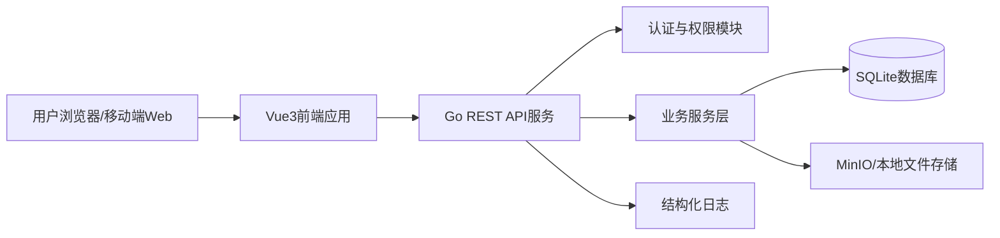
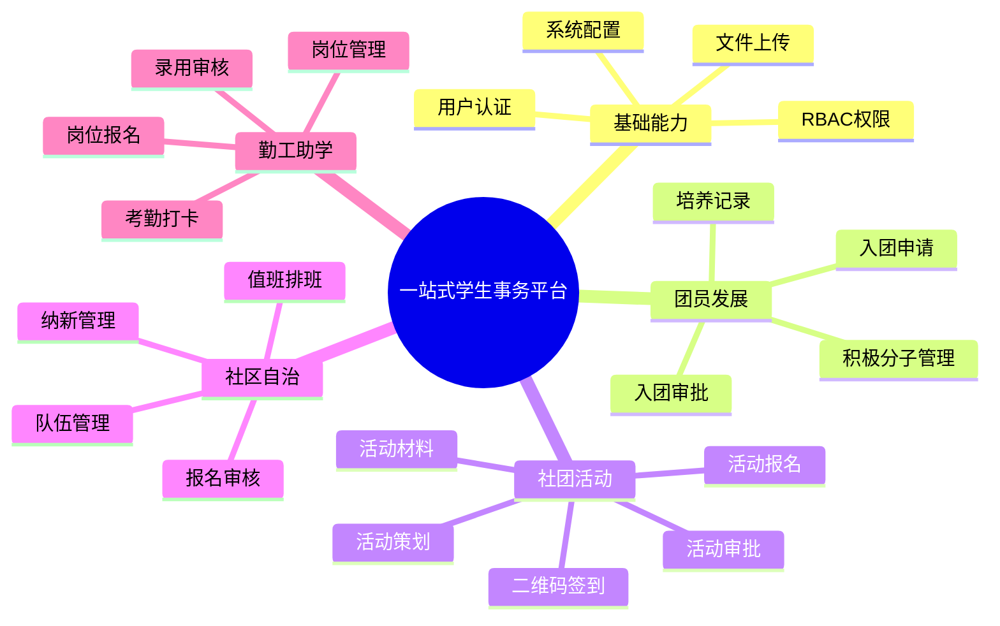
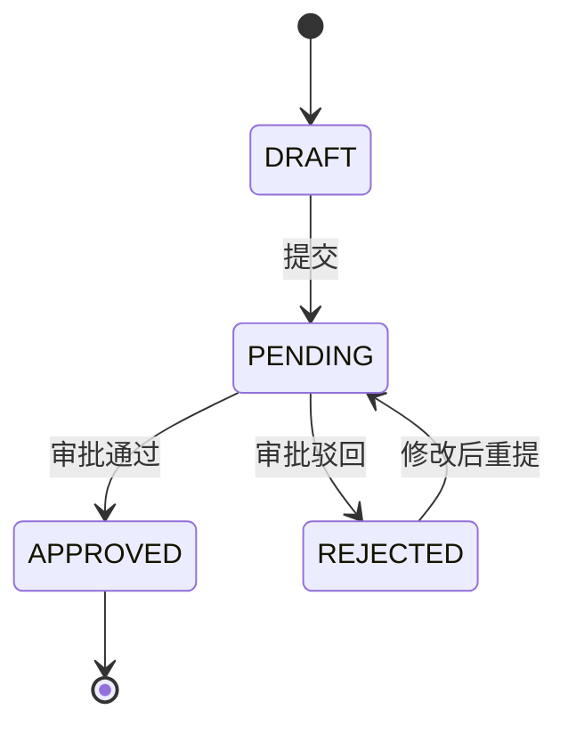
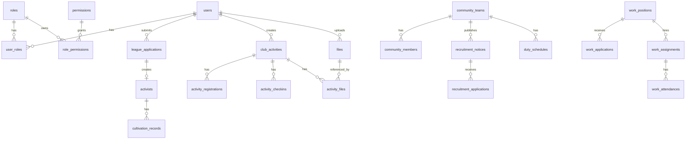

# 软件需求规格说明书（SRD）— 学生“一站式”自主管理过程管理系统

> 文档版本：v1.0 | 创建日期：2026-06-05 | 状态：评审中  
> 输入文档：`02-prd.md`、`03-brd.md`  
> 适用阶段：MVP 至增强阶段  
> 技术栈建议：Vue3 + Go + SQLite + GORM + JWT + MinIO

---

## 1. 系统概述

### 1.1 文档目的

本文档用于将产品需求文档（PRD）和业务需求文档（BRD）转化为可指导研发、测试、部署与验收的软件需求规格说明，明确系统边界、功能模块、权限模型、数据模型、API规范、文件管理、日志、安全与性能要求。

### 1.2 系统定位

学生“一站式”自主管理过程管理系统面向高校学生事务管理场景，提供统一入口，覆盖团员发展、社团活动、社区自治、勤工助学四大业务域，并通过统一认证、RBAC权限、文件上传、过程数据沉淀与统计能力，实现学生事务线上闭环、过程可追溯、数据可分析。

### 1.3 建设目标

| 目标 | 说明 | 关键指标 |
|------|------|----------|
| 流程线上化 | 将核心业务从纸质、Excel、微信群迁移至线上平台 | 入团申请线上化率 ≥ 95% |
| 数据资产化 | 统一沉淀学生过程性数据 | 电子档案生成率 100% |
| 管理智能化 | 为后续AI档案、评优推荐、数据看板预留结构化数据基础 | AI生成内容可用率 ≥ 80%（后续） |
| 体验一体化 | 学生通过统一入口办理事务 | 学生满意度 ≥ 4.0/5.0 |

### 1.4 系统范围

#### 1.4.1 MVP范围

| 模块 | MVP包含 |
|------|---------|
| 基础能力 | 登录/注册、JWT认证、角色权限、文件上传 |
| 团员发展 | 入团申请提交、一级审批、积极分子登记、培养记录 |
| 社团活动 | 活动创建、活动审批、活动报名、二维码签到、活动图片上传 |
| 社区自治 | 自治队伍管理、纳新发布与报名、值班排班 |
| 勤工助学 | 岗位发布、岗位报名、录用审核、简易考勤 |

#### 1.4.2 非MVP范围

- 多级审批流引擎
- 消息推送系统（短信、邮件、站内信）
- AI活动总结、AI档案、AI评优推荐
- 第三方教务系统/一卡通系统对接
- 移动端原生应用
- 国际化

### 1.5 用户角色

| 角色编码 | 角色名称 | 描述 |
|----------|----------|------|
| SYS_ADMIN | 系统管理员 | 负责用户、角色、权限、系统配置与数据备份 |
| LEAGUE_ADMIN | 团委管理员 | 负责入团申请审批、积极分子与培养记录管理 |
| STUDENT_AFFAIRS_ADMIN | 学工处管理员 | 负责勤工岗位、报名录用、考勤与工资核算数据 |
| COMMUNITY_ADMIN | 社区管理员 | 负责自治队伍、排班与志愿服务管理 |
| CLUB_TEACHER | 社团指导老师 | 负责社团活动审批与活动数据查看 |
| CLUB_LEADER | 社团负责人 | 负责活动策划、报名管理、签到与活动材料上传 |
| COMMUNITY_LEADER | 自治队伍负责人 | 负责纳新公告、报名审核、队伍值班管理 |
| STUDENT | 普通学生 | 办理入团申请、活动报名签到、自治队伍报名、勤工报名与打卡 |

### 1.6 总体架构要求

系统采用前后端分离架构：



架构分层要求：

| 层级 | 职责 |
|------|------|
| Presentation | 前端页面、路由、表单、权限菜单、移动端适配 |
| Handler/API | REST接口、参数绑定、鉴权、响应封装 |
| Service | 业务规则、状态流转、事务控制 |
| Repository | 数据访问、GORM模型映射、查询封装 |
| Infrastructure | 文件存储、日志、配置、JWT、密码加密 |

---

## 2. 功能模块设计

### 2.1 功能模块总览



### 2.2 基础能力模块

#### 2.2.1 用户认证

| 项目 | 说明 |
|------|------|
| 功能编码 | SRD-BAS-001 |
| 功能名称 | 用户认证 |
| 参与角色 | 全部用户 |
| 前置条件 | 用户账号已存在或开放注册 |
| 输入 | 学号/工号、密码 |
| 输出 | JWT令牌、用户信息、角色列表、权限列表 |
| 业务规则 | 密码≥8位且包含字母和数字；登录失败5次锁定30分钟；JWT有效期24小时 |

流程：

1. 用户提交账号密码。
2. 后端校验账号状态与密码哈希。
3. 校验成功后生成JWT。
4. 返回用户基础信息、角色、权限和令牌。
5. 前端后续请求通过`Authorization: Bearer <token>`携带令牌。

#### 2.2.2 RBAC权限管理

| 项目 | 说明 |
|------|------|
| 功能编码 | SRD-BAS-002 |
| 功能名称 | 角色权限管理 |
| 参与角色 | 系统管理员 |
| 输入 | 用户、角色、权限、菜单配置 |
| 输出 | 权限校验结果、动态菜单 |
| 业务规则 | 用户可拥有多个角色，权限取并集；后端接口必须强制校验权限 |

#### 2.2.3 文件上传

| 项目 | 说明 |
|------|------|
| 功能编码 | SRD-BAS-003 |
| 功能名称 | 统一文件上传 |
| 参与角色 | 全部授权用户 |
| 输入 | jpg/jpeg/png/pdf/doc/docx文件 |
| 输出 | 文件URL、文件ID、文件元数据 |
| 业务规则 | 单文件≤10MB；文件类型白名单；默认存储至MinIO，MVP可降级本地存储 |

### 2.3 团员发展模块

#### 2.3.1 入团申请管理

| 项目 | 说明 |
|------|------|
| 功能编码 | SRD-LEG-001 |
| 功能名称 | 入团申请提交 |
| 参与角色 | 普通学生 |
| 输入 | 申请理由、个人简历、基础信息 |
| 输出 | 入团申请记录，状态为`PENDING` |
| 业务规则 | 每位学生仅可存在一条有效入团申请；驳回后可重新提交并保留上次内容 |

状态机：



#### 2.3.2 入团审批

| 项目 | 说明 |
|------|------|
| 功能编码 | SRD-LEG-002 |
| 功能名称 | 入团申请审批 |
| 参与角色 | 团委管理员 |
| 输入 | 审批动作、审批意见 |
| 输出 | 审批结果、积极分子记录 |
| 业务规则 | MVP采用一级审批；审批通过后自动创建积极分子记录 |

#### 2.3.3 积极分子与培养记录

| 项目 | 说明 |
|------|------|
| 功能编码 | SRD-LEG-003 |
| 功能名称 | 积极分子培养管理 |
| 参与角色 | 团委管理员、普通学生 |
| 输入 | 记录类型、记录内容、附件 |
| 输出 | 培养记录时间线 |
| 业务规则 | 培养记录仅追加，不允许物理删除；思想汇报需管理员确认 |

培养记录类型：

| 类型 | 说明 |
|------|------|
| THOUGHT_REPORT | 思想汇报 |
| TRAINING | 培训记录 |
| PRACTICE | 实践经历 |
| REVIEW | 管理员评语 |

### 2.4 社团活动模块

#### 2.4.1 活动策划与审批

| 项目 | 说明 |
|------|------|
| 功能编码 | SRD-ACT-001 |
| 功能名称 | 活动创建与审批 |
| 参与角色 | 社团负责人、社团指导老师 |
| 输入 | 活动名称、时间、地点、人数上限、内容、预算 |
| 输出 | 活动记录、审批记录 |
| 业务规则 | 活动时间不得早于当前日期；活动审批采用一级审批；驳回后可修改重提 |

活动状态：

| 状态 | 说明 |
|------|------|
| DRAFT | 草稿 |
| PENDING | 待审批 |
| REJECTED | 已驳回 |
| REG_OPEN | 报名中 |
| REG_CLOSED | 报名截止 |
| IN_PROGRESS | 进行中 |
| COMPLETED | 已结束 |
| ARCHIVED | 已归档 |

#### 2.4.2 活动报名

| 项目 | 说明 |
|------|------|
| 功能编码 | SRD-ACT-002 |
| 功能名称 | 活动报名 |
| 参与角色 | 普通学生 |
| 输入 | 活动ID、学生ID |
| 输出 | 活动报名记录 |
| 业务规则 | 每人每活动仅可报名一次；报名人数不得超过上限；活动开始前可取消报名 |

#### 2.4.3 二维码签到

| 项目 | 说明 |
|------|------|
| 功能编码 | SRD-ACT-003 |
| 功能名称 | 活动二维码签到 |
| 参与角色 | 社团负责人、普通学生 |
| 输入 | 活动ID、签名令牌、学生身份 |
| 输出 | 签到记录 |
| 业务规则 | 签到有效期为活动开始前30分钟至活动结束；二维码每15分钟刷新；仅已报名学生可签到；每人每活动仅可签到一次 |

二维码载荷建议：

```json
{
  "activity_id": 1001,
  "issued_at": 1780665600,
  "expires_at": 1780666500,
  "nonce": "random-string",
  "signature": "hmac-sha256"
}
```

### 2.5 社区自治模块

#### 2.5.1 自治队伍管理

| 项目 | 说明 |
|------|------|
| 功能编码 | SRD-COM-001 |
| 功能名称 | 自治队伍管理 |
| 参与角色 | 社区管理员 |
| 输入 | 队伍名称、所属区域、负责人、成员 |
| 输出 | 队伍详情、成员列表 |
| 业务规则 | 队伍名称唯一；负责人必须为队伍成员；删除队伍前需移除所有成员 |

#### 2.5.2 纳新管理

| 项目 | 说明 |
|------|------|
| 功能编码 | SRD-COM-002 |
| 功能名称 | 纳新公告与报名 |
| 参与角色 | 自治队伍负责人、普通学生 |
| 输入 | 招聘要求、招聘人数、截止日期、报名申请 |
| 输出 | 纳新公告、报名记录、审核结果 |
| 业务规则 | 截止日期后自动关闭报名；录用人数不得超过招聘人数 |

#### 2.5.3 值班排班

| 项目 | 说明 |
|------|------|
| 功能编码 | SRD-COM-003 |
| 功能名称 | 值班排班 |
| 参与角色 | 社区管理员、自治队伍负责人 |
| 输入 | 队伍、日期、时间段、值班人员 |
| 输出 | 排班表、冲突检测结果 |
| 业务规则 | 同一人员同一时间段不可重复排班；冲突时阻止保存并提示冲突项 |

### 2.6 勤工助学模块

#### 2.6.1 岗位管理与报名

| 项目 | 说明 |
|------|------|
| 功能编码 | SRD-WORK-001 |
| 功能名称 | 勤工岗位发布与报名 |
| 参与角色 | 学工处管理员、普通学生 |
| 输入 | 岗位名称、部门、人数、薪资、要求、报名申请 |
| 输出 | 岗位列表、报名记录 |
| 业务规则 | 每位学生同一时间仅可持有一个在岗岗位；岗位可设置报名截止日期 |

#### 2.6.2 录用审核

| 项目 | 说明 |
|------|------|
| 功能编码 | SRD-WORK-002 |
| 功能名称 | 岗位报名审核 |
| 参与角色 | 学工处管理员 |
| 输入 | 审核动作、审核意见 |
| 输出 | 录用/不录用结果 |
| 业务规则 | 录用人数不得超过岗位招聘人数；录用后生成在岗关系 |

#### 2.6.3 考勤打卡

| 项目 | 说明 |
|------|------|
| 功能编码 | SRD-WORK-003 |
| 功能名称 | 勤工考勤打卡 |
| 参与角色 | 已录用学生、学工处管理员 |
| 输入 | 岗位ID、打卡类型、打卡时间 |
| 输出 | 考勤记录、工时、异常标记 |
| 业务规则 | 上班打卡后才能下班打卡；系统自动计算工时；迟到/早退自动标记；缺卡由管理员补录 |

---

## 3. 权限模型

### 3.1 RBAC模型

系统采用基于角色的访问控制（RBAC）：


### 3.2 权限命名规范

权限编码采用：`资源:动作`。

| 动作 | 说明 |
|------|------|
| create | 新增 |
| read | 查询 |
| update | 编辑 |
| delete | 删除 |
| approve | 审批 |
| export | 导出 |
| upload | 上传 |
| checkin | 签到/打卡 |

示例：

| 权限编码 | 说明 |
|----------|------|
| league_application:create | 提交入团申请 |
| league_application:approve | 审批入团申请 |
| club_activity:create | 创建社团活动 |
| club_activity:approve | 审批社团活动 |
| club_checkin:checkin | 活动签到 |
| work_attendance:checkin | 勤工打卡 |

### 3.3 角色权限矩阵

| 功能/角色 | SYS_ADMIN | LEAGUE_ADMIN | STUDENT_AFFAIRS_ADMIN | COMMUNITY_ADMIN | CLUB_TEACHER | CLUB_LEADER | COMMUNITY_LEADER | STUDENT |
|-----------|-----------|--------------|-----------------------|-----------------|--------------|-------------|------------------|---------|
| 用户管理 | CRUD | R | - | - | - | - | - | - |
| 角色权限 | CRUD | - | - | - | - | - | - | - |
| 入团申请 | R | R/A | R | R | R | C/R | R | C/R |
| 积极分子 | R | CRUD | R | R | R | - | - | R(本人) |
| 活动策划 | R | R | R | R | R/A | CRUD | R | R |
| 活动报名 | R | R | R | R | R | R | R | C/R(本人) |
| 活动签到 | R | R | R | R | R | R | R | C/R(本人) |
| 自治队伍 | R | R | R | CRUD | R | R | R/U | R |
| 纳新报名 | R | R | R | R/A | R | R | R/A | C/R(本人) |
| 值班排班 | R | R | R | CRUD | R | R | CRUD(本队) | R(本人) |
| 勤工岗位 | R | R | CRUD | R | R | R | R | R |
| 勤工报名 | R | R | CRUD/A | R | R | R | R | C/R(本人) |
| 勤工考勤 | R | R | CRUD | R | R | R | R | C/R(本人) |
| 文件管理 | CRUD | R/U | R/U | R/U | R/U | U | U | U |

说明：

- `A`表示审批。
- 普通学生只能查看和操作本人数据。
- 社团负责人仅可操作自己负责社团的活动。
- 自治队伍负责人仅可操作自己负责队伍的数据。
- 系统管理员拥有系统级配置权限，但业务审批应保留给业务角色。

### 3.4 数据权限规则

| 场景 | 数据权限规则 |
|------|--------------|
| 学生个人数据 | 仅本人、相关业务管理员、系统管理员可查看 |
| 社团活动 | 社团负责人仅管理本社团活动；指导老师仅审批关联社团活动 |
| 自治队伍 | 队伍负责人仅管理本队伍成员、纳新、排班 |
| 勤工岗位 | 学工处管理员管理全部岗位；学生仅查看公开岗位和本人报名/考勤 |
| 入团申请 | 学生仅查看本人申请；团委管理员查看全部申请 |

---

## 4. 数据模型

### 4.1 数据建模原则

1. 主键统一使用自增整型或雪花ID，MVP阶段可使用SQLite自增ID。
2. 所有业务表必须包含：`created_at`、`updated_at`。
3. 需要软删除的表包含：`deleted_at`。
4. 审批、状态变更、文件上传必须保留操作人和操作时间。
5. 金额字段使用`DECIMAL`，禁止使用浮点数。
6. 枚举字段使用稳定编码，不直接存中文。

### 4.2 核心实体关系



### 4.3 基础表

#### 4.3.1 users 用户表

| 字段 | 类型 | 必填 | 约束 | 说明 |
|------|------|------|------|------|
| id | INTEGER | 是 | PK | 用户ID |
| account | VARCHAR(50) | 是 | UNIQUE | 学号/工号 |
| name | VARCHAR(50) | 是 | - | 姓名 |
| password_hash | VARCHAR(255) | 是 | - | 密码哈希 |
| user_type | VARCHAR(20) | 是 | INDEX | student/staff/admin |
| department | VARCHAR(100) | 否 | INDEX | 院系/部门 |
| grade | VARCHAR(10) | 否 | INDEX | 年级 |
| phone | VARCHAR(20) | 否 | - | 联系方式 |
| status | VARCHAR(20) | 是 | INDEX | active/locked/disabled |
| failed_login_count | INTEGER | 是 | DEFAULT 0 | 登录失败次数 |
| locked_until | DATETIME | 否 | - | 锁定截止时间 |
| created_at | DATETIME | 是 | - | 创建时间 |
| updated_at | DATETIME | 是 | - | 更新时间 |

#### 4.3.2 roles 角色表

| 字段 | 类型 | 必填 | 约束 | 说明 |
|------|------|------|------|------|
| id | INTEGER | 是 | PK | 角色ID |
| code | VARCHAR(50) | 是 | UNIQUE | 角色编码 |
| name | VARCHAR(50) | 是 | - | 角色名称 |
| description | TEXT | 否 | - | 描述 |
| created_at | DATETIME | 是 | - | 创建时间 |
| updated_at | DATETIME | 是 | - | 更新时间 |

#### 4.3.3 permissions 权限表

| 字段 | 类型 | 必填 | 约束 | 说明 |
|------|------|------|------|------|
| id | INTEGER | 是 | PK | 权限ID |
| code | VARCHAR(100) | 是 | UNIQUE | 权限编码 |
| name | VARCHAR(100) | 是 | - | 权限名称 |
| resource | VARCHAR(50) | 是 | INDEX | 资源 |
| action | VARCHAR(50) | 是 | INDEX | 动作 |
| created_at | DATETIME | 是 | - | 创建时间 |
| updated_at | DATETIME | 是 | - | 更新时间 |

### 4.4 团员发展表

#### 4.4.1 league_applications 入团申请表

| 字段 | 类型 | 必填 | 约束 | 说明 |
|------|------|------|------|------|
| id | INTEGER | 是 | PK | 申请ID |
| student_id | INTEGER | 是 | FK, INDEX | 申请人 |
| reason | TEXT | 是 | - | 申请理由 |
| resume | TEXT | 否 | - | 个人简历 |
| status | VARCHAR(20) | 是 | INDEX | draft/pending/approved/rejected |
| approval_opinion | TEXT | 否 | - | 审批意见 |
| approved_by | INTEGER | 否 | FK | 审批人 |
| approved_at | DATETIME | 否 | - | 审批时间 |
| created_at | DATETIME | 是 | - | 创建时间 |
| updated_at | DATETIME | 是 | - | 更新时间 |

#### 4.4.2 activists 积极分子表

| 字段 | 类型 | 必填 | 约束 | 说明 |
|------|------|------|------|------|
| id | INTEGER | 是 | PK | 积极分子ID |
| student_id | INTEGER | 是 | FK, UNIQUE | 学生ID |
| application_id | INTEGER | 是 | FK | 来源申请 |
| status | VARCHAR(20) | 是 | INDEX | cultivating/developed/eliminated |
| registered_date | DATE | 是 | - | 登记日期 |
| status_reason | TEXT | 否 | - | 状态变更原因 |
| created_at | DATETIME | 是 | - | 创建时间 |
| updated_at | DATETIME | 是 | - | 更新时间 |

#### 4.4.3 cultivation_records 培养记录表

| 字段 | 类型 | 必填 | 约束 | 说明 |
|------|------|------|------|------|
| id | INTEGER | 是 | PK | 记录ID |
| activist_id | INTEGER | 是 | FK, INDEX | 积极分子ID |
| record_type | VARCHAR(30) | 是 | INDEX | thought_report/training/practice/review |
| content | TEXT | 是 | - | 记录内容 |
| file_id | INTEGER | 否 | FK | 附件 |
| status | VARCHAR(20) | 是 | INDEX | pending/confirmed |
| created_by | INTEGER | 是 | FK | 创建人 |
| confirmed_by | INTEGER | 否 | FK | 确认人 |
| confirmed_at | DATETIME | 否 | - | 确认时间 |
| created_at | DATETIME | 是 | - | 创建时间 |
| updated_at | DATETIME | 是 | - | 更新时间 |

### 4.5 社团活动表

#### 4.5.1 club_activities 活动表

| 字段 | 类型 | 必填 | 约束 | 说明 |
|------|------|------|------|------|
| id | INTEGER | 是 | PK | 活动ID |
| club_name | VARCHAR(100) | 是 | INDEX | 社团名称 |
| title | VARCHAR(200) | 是 | INDEX | 活动名称 |
| start_time | DATETIME | 是 | INDEX | 开始时间 |
| end_time | DATETIME | 是 | INDEX | 结束时间 |
| location | VARCHAR(200) | 是 | - | 地点 |
| capacity | INTEGER | 是 | - | 人数上限 |
| description | TEXT | 是 | - | 内容描述 |
| budget | DECIMAL(10,2) | 否 | - | 预算 |
| status | VARCHAR(20) | 是 | INDEX | 活动状态 |
| approval_opinion | TEXT | 否 | - | 审批意见 |
| created_by | INTEGER | 是 | FK | 创建人 |
| approved_by | INTEGER | 否 | FK | 审批人 |
| approved_at | DATETIME | 否 | - | 审批时间 |
| created_at | DATETIME | 是 | - | 创建时间 |
| updated_at | DATETIME | 是 | - | 更新时间 |

#### 4.5.2 activity_registrations 活动报名表

| 字段 | 类型 | 必填 | 约束 | 说明 |
|------|------|------|------|------|
| id | INTEGER | 是 | PK | 报名ID |
| activity_id | INTEGER | 是 | FK, INDEX | 活动ID |
| student_id | INTEGER | 是 | FK, INDEX | 学生ID |
| status | VARCHAR(20) | 是 | INDEX | registered/cancelled |
| registered_at | DATETIME | 是 | - | 报名时间 |
| cancelled_at | DATETIME | 否 | - | 取消时间 |
| created_at | DATETIME | 是 | - | 创建时间 |
| updated_at | DATETIME | 是 | - | 更新时间 |

唯一约束：`UNIQUE(activity_id, student_id)`。

#### 4.5.3 activity_checkins 活动签到表

| 字段 | 类型 | 必填 | 约束 | 说明 |
|------|------|------|------|------|
| id | INTEGER | 是 | PK | 签到ID |
| activity_id | INTEGER | 是 | FK, INDEX | 活动ID |
| student_id | INTEGER | 是 | FK, INDEX | 学生ID |
| checkin_time | DATETIME | 是 | INDEX | 签到时间 |
| checkin_method | VARCHAR(20) | 是 | - | qr/manual |
| created_at | DATETIME | 是 | - | 创建时间 |

唯一约束：`UNIQUE(activity_id, student_id)`。

### 4.6 社区自治表

| 表名 | 说明 | 关键字段 |
|------|------|----------|
| community_teams | 自治队伍 | id, name, area, leader_id, status |
| community_members | 队伍成员 | team_id, user_id, role, joined_at, status |
| recruitment_notices | 纳新公告 | team_id, requirements, quota, deadline, status |
| recruitment_applications | 纳新报名 | notice_id, student_id, status, review_opinion |
| duty_schedules | 值班排班 | team_id, duty_date, time_slot, user_id, status |
| duty_attendances | 值班出勤 | schedule_id, user_id, attendance_status, hours |

关键约束：

- `community_teams.name`唯一。
- `community_members(team_id, user_id)`唯一。
- `duty_schedules(user_id, duty_date, time_slot)`唯一。

### 4.7 勤工助学表

| 表名 | 说明 | 关键字段 |
|------|------|----------|
| work_positions | 勤工岗位 | title, department, quota, salary, requirements, deadline, status |
| work_applications | 岗位报名 | position_id, student_id, status, review_opinion |
| work_assignments | 在岗关系 | position_id, student_id, start_date, end_date, status |
| work_attendances | 考勤记录 | assignment_id, work_date, clock_in_at, clock_out_at, hours, exception_type |

关键约束：

- 同一学生仅允许一个`active`状态的`work_assignments`。
- `work_attendances(assignment_id, work_date)`唯一。

### 4.8 文件表

#### files 文件元数据表

| 字段 | 类型 | 必填 | 约束 | 说明 |
|------|------|------|------|------|
| id | INTEGER | 是 | PK | 文件ID |
| original_name | VARCHAR(255) | 是 | - | 原文件名 |
| object_key | VARCHAR(500) | 是 | UNIQUE | 存储对象Key |
| bucket | VARCHAR(100) | 是 | - | 存储桶 |
| content_type | VARCHAR(100) | 是 | - | MIME类型 |
| size | INTEGER | 是 | - | 文件大小，单位Byte |
| url | VARCHAR(500) | 是 | - | 访问URL |
| biz_type | VARCHAR(50) | 是 | INDEX | 业务类型 |
| uploaded_by | INTEGER | 是 | FK | 上传人 |
| created_at | DATETIME | 是 | - | 上传时间 |

---

## 5. API规范

### 5.1 通用规范

| 项目 | 规范 |
|------|------|
| 协议 | HTTPS |
| API风格 | RESTful |
| 数据格式 | JSON |
| 字符编码 | UTF-8 |
| 路径前缀 | `/api/v1` |
| 认证方式 | `Authorization: Bearer <JWT>` |
| API文档 | OpenAPI 3.0 / Swagger |

### 5.2 通用响应结构

成功响应：

```json
{
  "code": 0,
  "message": "success",
  "data": {},
  "request_id": "req-20260605-000001"
}
```

失败响应：

```json
{
  "code": 40001,
  "message": "参数校验失败",
  "errors": [
    {
      "field": "title",
      "reason": "活动名称不能为空"
    }
  ],
  "request_id": "req-20260605-000001"
}
```

分页响应：

```json
{
  "code": 0,
  "message": "success",
  "data": {
    "items": [],
    "page": 1,
    "page_size": 20,
    "total": 100
  },
  "request_id": "req-20260605-000001"
}
```

### 5.3 HTTP状态码

| 状态码 | 使用场景 |
|--------|----------|
| 200 | 查询、更新、删除成功 |
| 201 | 创建成功 |
| 400 | 参数错误 |
| 401 | 未认证或令牌失效 |
| 403 | 无权限 |
| 404 | 资源不存在 |
| 409 | 业务冲突，如重复报名、人数已满 |
| 422 | 业务规则校验失败 |
| 500 | 服务端异常 |

### 5.4 业务错误码

| 错误码 | 说明 |
|--------|------|
| 40001 | 参数校验失败 |
| 40101 | 未登录 |
| 40102 | 令牌已过期 |
| 40301 | 权限不足 |
| 40901 | 重复提交 |
| 40902 | 人数已满 |
| 40903 | 状态不允许操作 |
| 42201 | 业务规则校验失败 |
| 50001 | 系统内部错误 |

### 5.5 认证与用户API

| 方法 | 路径 | 权限 | 说明 |
|------|------|------|------|
| POST | `/auth/login` | 公开 | 登录 |
| POST | `/auth/register` | 公开/配置控制 | 注册 |
| POST | `/auth/logout` | 登录用户 | 退出登录 |
| GET | `/auth/me` | 登录用户 | 当前用户信息 |
| GET | `/users` | `user:read` | 用户列表 |
| POST | `/users` | `user:create` | 创建用户 |
| PUT | `/users/{id}` | `user:update` | 更新用户 |
| POST | `/users/{id}/roles` | `user:update` | 分配角色 |

登录请求示例：

```json
{
  "account": "20260001",
  "password": "Password123"
}
```

登录响应示例：

```json
{
  "token": "jwt-token",
  "expires_in": 86400,
  "user": {
    "id": 1,
    "account": "20260001",
    "name": "李同学"
  },
  "roles": ["STUDENT"],
  "permissions": ["club_activity:read"]
}
```

### 5.6 团员发展API

| 方法 | 路径 | 权限 | 说明 |
|------|------|------|------|
| POST | `/league/applications` | `league_application:create` | 提交入团申请 |
| GET | `/league/applications` | `league_application:read` | 查询申请列表 |
| GET | `/league/applications/{id}` | `league_application:read` | 查询申请详情 |
| PUT | `/league/applications/{id}` | `league_application:update` | 修改申请 |
| POST | `/league/applications/{id}/submit` | `league_application:create` | 草稿提交 |
| POST | `/league/applications/{id}/approve` | `league_application:approve` | 审批通过 |
| POST | `/league/applications/{id}/reject` | `league_application:approve` | 审批驳回 |
| GET | `/league/activists` | `activist:read` | 积极分子列表 |
| GET | `/league/activists/{id}` | `activist:read` | 积极分子详情 |
| POST | `/league/activists/{id}/records` | `cultivation_record:create` | 新增培养记录 |
| POST | `/league/records/{id}/confirm` | `cultivation_record:approve` | 确认思想汇报 |

### 5.7 社团活动API

| 方法 | 路径 | 权限 | 说明 |
|------|------|------|------|
| POST | `/club/activities` | `club_activity:create` | 创建活动 |
| GET | `/club/activities` | `club_activity:read` | 活动列表 |
| GET | `/club/activities/{id}` | `club_activity:read` | 活动详情 |
| PUT | `/club/activities/{id}` | `club_activity:update` | 修改活动 |
| POST | `/club/activities/{id}/submit` | `club_activity:create` | 提交审批 |
| POST | `/club/activities/{id}/approve` | `club_activity:approve` | 审批通过 |
| POST | `/club/activities/{id}/reject` | `club_activity:approve` | 审批驳回 |
| POST | `/club/activities/{id}/registrations` | `activity_registration:create` | 活动报名 |
| DELETE | `/club/activities/{id}/registrations/me` | `activity_registration:delete` | 取消报名 |
| POST | `/club/activities/{id}/qrcode` | `club_checkin:create` | 生成签到码 |
| POST | `/club/activities/{id}/checkins` | `club_checkin:checkin` | 扫码签到 |
| GET | `/club/activities/{id}/checkins` | `club_checkin:read` | 签到列表 |
| POST | `/club/activities/{id}/files` | `file:upload` | 上传活动文件 |

### 5.8 社区自治API

| 方法 | 路径 | 权限 | 说明 |
|------|------|------|------|
| POST | `/community/teams` | `community_team:create` | 创建队伍 |
| GET | `/community/teams` | `community_team:read` | 队伍列表 |
| GET | `/community/teams/{id}` | `community_team:read` | 队伍详情 |
| PUT | `/community/teams/{id}` | `community_team:update` | 更新队伍 |
| DELETE | `/community/teams/{id}` | `community_team:delete` | 删除队伍 |
| POST | `/community/teams/{id}/members` | `community_member:create` | 添加成员 |
| POST | `/community/teams/{id}/recruitments` | `recruitment:create` | 发布纳新 |
| GET | `/community/recruitments` | `recruitment:read` | 纳新列表 |
| POST | `/community/recruitments/{id}/applications` | `recruitment_application:create` | 报名纳新 |
| POST | `/community/recruitment-applications/{id}/approve` | `recruitment_application:approve` | 通过纳新报名 |
| POST | `/community/recruitment-applications/{id}/reject` | `recruitment_application:approve` | 驳回纳新报名 |
| POST | `/community/schedules` | `duty_schedule:create` | 创建排班 |
| GET | `/community/schedules` | `duty_schedule:read` | 排班查询 |

### 5.9 勤工助学API

| 方法 | 路径 | 权限 | 说明 |
|------|------|------|------|
| POST | `/work/positions` | `work_position:create` | 发布岗位 |
| GET | `/work/positions` | `work_position:read` | 岗位列表 |
| GET | `/work/positions/{id}` | `work_position:read` | 岗位详情 |
| PUT | `/work/positions/{id}` | `work_position:update` | 更新岗位 |
| POST | `/work/positions/{id}/close` | `work_position:update` | 下架岗位 |
| POST | `/work/positions/{id}/applications` | `work_application:create` | 报名岗位 |
| GET | `/work/applications` | `work_application:read` | 报名列表 |
| POST | `/work/applications/{id}/approve` | `work_application:approve` | 录用 |
| POST | `/work/applications/{id}/reject` | `work_application:approve` | 不录用 |
| POST | `/work/attendances/clock-in` | `work_attendance:checkin` | 上班打卡 |
| POST | `/work/attendances/clock-out` | `work_attendance:checkin` | 下班打卡 |
| GET | `/work/attendances` | `work_attendance:read` | 考勤列表 |
| POST | `/work/attendances/{id}/adjust` | `work_attendance:update` | 管理员补录/调整 |

### 5.10 文件API

| 方法 | 路径 | 权限 | 说明 |
|------|------|------|------|
| POST | `/files` | `file:upload` | 上传文件 |
| GET | `/files/{id}` | `file:read` | 文件元数据 |
| DELETE | `/files/{id}` | `file:delete` | 删除文件/标记无效 |

---

## 6. 文件管理规范

### 6.1 存储方式

| 阶段 | 存储方案 | 说明 |
|------|----------|------|
| MVP默认 | MinIO | S3兼容接口，适合后续扩展 |
| MVP降级 | 本地文件系统 | MinIO部署困难时使用，仅限开发/试点 |
| 后续扩展 | 云对象存储 | 可迁移至阿里云OSS、腾讯云COS、AWS S3 |

### 6.2 文件类型与大小

| 类型 | 扩展名 | MIME类型 | 大小限制 |
|------|--------|----------|----------|
| 图片 | jpg/jpeg/png | image/jpeg, image/png | ≤10MB |
| PDF | pdf | application/pdf | ≤10MB |
| Word | doc/docx | application/msword, application/vnd.openxmlformats-officedocument.wordprocessingml.document | ≤10MB |

### 6.3 对象Key规范

对象Key格式：

```text
{env}/{biz_type}/{yyyy}/{mm}/{dd}/{uuid}.{ext}
```

示例：

```text
prod/club_activity/2026/06/05/550e8400-e29b-41d4-a716-446655440000.png
```

### 6.4 业务类型编码

| 编码 | 说明 |
|------|------|
| league_application | 入团申请附件 |
| cultivation_record | 培养记录附件 |
| club_activity | 社团活动图片/材料 |
| community_recruitment | 纳新材料 |
| work_position | 勤工岗位附件 |
| user_avatar | 用户头像 |

### 6.5 文件安全要求

1. 后端必须校验扩展名、MIME类型与文件大小。
2. 文件名不得直接使用用户上传原始文件名作为对象Key。
3. 文件URL应通过后端受控返回，不应暴露内部存储凭证。
4. 私有文件应使用临时签名URL或后端代理下载。
5. 删除业务记录时，不立即物理删除文件，优先标记为未引用或软删除。
6. 禁止上传可执行文件、脚本文件、压缩包和HTML文件。

---

## 7. 日志规范

### 7.1 日志目标

日志用于问题排查、安全审计、性能分析和关键业务追溯。系统应输出结构化JSON日志，并通过`request_id`贯穿一次请求的完整链路。

### 7.2 日志级别

| 级别 | 使用场景 |
|------|----------|
| DEBUG | 开发调试信息，生产默认关闭 |
| INFO | 正常业务操作、系统启动、请求摘要 |
| WARN | 可恢复异常、业务规则拦截、登录失败 |
| ERROR | 系统异常、外部服务失败、数据库错误 |
| FATAL | 服务无法继续运行的严重错误 |

### 7.3 日志字段

```json
{
  "timestamp": "2026-06-05T10:00:00+08:00",
  "level": "INFO",
  "request_id": "req-20260605-000001",
  "user_id": 1,
  "account": "20260001",
  "role": "STUDENT",
  "method": "POST",
  "path": "/api/v1/club/activities/1/checkins",
  "status": 200,
  "duration_ms": 35,
  "client_ip": "10.0.0.1",
  "message": "activity checkin success"
}
```

### 7.4 必须记录的关键操作

| 类别 | 操作 |
|------|------|
| 认证安全 | 登录成功、登录失败、账号锁定、退出登录 |
| 权限管理 | 角色创建、权限变更、用户角色分配 |
| 审批操作 | 入团审批、活动审批、岗位录用、纳新审核 |
| 数据变更 | 创建/更新/删除关键业务数据 |
| 文件操作 | 文件上传、下载、删除 |
| 考勤签到 | 活动签到、勤工打卡、管理员补录 |
| 异常事件 | 权限拒绝、参数异常、系统错误 |

### 7.5 日志脱敏

日志中禁止明文记录：

- 密码、密码哈希、JWT完整内容
- 身份证号、手机号完整值
- 文件存储访问密钥
- 数据库连接串密码

脱敏规则：

| 字段 | 脱敏示例 |
|------|----------|
| 手机号 | 138****5678 |
| 身份证号 | 110***********1234 |
| JWT | 仅记录前8位摘要 |

### 7.6 日志保留

| 日志类别 | 在线保留 | 归档保留 |
|----------|----------|----------|
| 应用日志 | 30天 | 1年 |
| 访问日志 | 30天 | 1年 |
| 安全日志 | 6个月 | 3年 |
| 操作审计日志 | 6个月 | 3年 |

---

## 8. 安全规范

### 8.1 认证安全

1. 所有非公开API必须校验JWT。
2. JWT有效期为24小时。
3. 密码使用bcrypt哈希存储，salt rounds ≥ 10。
4. 登录失败5次锁定30分钟。
5. 退出登录后前端必须清除本地令牌。
6. 生产环境必须启用HTTPS。

### 8.2 授权安全

1. 后端必须执行RBAC校验，不信任前端菜单控制。
2. 数据权限必须在服务端过滤。
3. 普通学生只能访问本人业务数据。
4. 负责人角色只能访问其负责组织范围内的数据。
5. 审批接口必须校验审批人角色和业务归属。

### 8.3 输入校验

| 输入类型 | 校验要求 |
|----------|----------|
| 文本 | 长度限制、必填校验、特殊字符处理 |
| ID参数 | 必须为合法整数，且资源存在 |
| 日期时间 | 格式合法，业务时间不可冲突 |
| 枚举 | 必须属于后端定义的枚举集合 |
| 文件 | 类型、大小、MIME、扩展名白名单 |

### 8.4 常见漏洞防护

| 风险 | 防护要求 |
|------|----------|
| SQL注入 | 使用GORM参数化查询，禁止拼接SQL |
| XSS | 前端输出转义，富文本内容过滤，配置CSP |
| CSRF | 使用Bearer Token；如使用Cookie需设置SameSite和CSRF Token |
| 越权访问 | 所有详情、更新、删除接口校验资源归属 |
| 文件上传攻击 | 类型白名单、随机对象Key、禁止执行权限 |
| 暴力破解 | 登录失败计数、账号锁定、必要时增加验证码 |
| 敏感信息泄露 | 错误信息不暴露堆栈、配置密钥不入库不入日志 |

### 8.5 数据安全

1. 数据库文件必须纳入每日备份。
2. 备份文件应限制访问权限。
3. 敏感字段如身份证号（若后续引入）应使用AES-256加密存储。
4. 删除操作优先采用软删除，保留审计追溯能力。
5. 导出数据（后续功能）必须进行权限校验和水印/脱敏处理。

### 8.6 安全验收标准

| 项目 | 标准 |
|------|------|
| 高危漏洞 | 0个 |
| 严重漏洞 | 0个 |
| 权限绕过 | 0个 |
| 明文密码 | 禁止 |
| 未鉴权接口 | 除登录、注册、公开活动/岗位查询外禁止 |
| 文件上传绕过 | 禁止 |

---

## 9. 性能要求

### 9.1 性能指标

| 指标 | 要求 | 说明 |
|------|------|------|
| 首屏加载时间 | ≤2秒 | 常规校园网/3G环境 |
| API响应时间 | 95%请求≤500ms | 不含文件上传 |
| 文件上传 | 10MB文件≤30秒 | 局域网或校园网环境 |
| 并发用户 | 支持500并发用户 | 报名/签到高峰 |
| 单表查询 | ≤100ms | 10万级数据量常见查询 |
| 数据写入延迟 | ≤1秒 | 普通业务操作事务提交 |

### 9.2 容量指标

| 数据对象 | MVP容量 | 设计容量 |
|----------|---------|----------|
| 用户数 | 5,000 | 50,000 |
| 入团申请 | 1,000/年 | 10,000/年 |
| 社团活动 | 2,000/年 | 20,000/年 |
| 活动签到 | 50,000/年 | 500,000/年 |
| 勤工岗位 | 1,000/年 | 10,000/年 |
| 考勤记录 | 100,000/年 | 1,000,000/年 |
| 文件存储 | 100GB | 1TB |

### 9.3 数据库性能要求

1. 高频查询字段必须建立索引：用户账号、角色编码、状态字段、业务外键、时间字段。
2. 列表接口必须分页，默认`page_size=20`，最大不超过`100`。
3. 后台统计类查询不得阻塞核心交易接口。
4. SQLite阶段应避免长事务和高并发写入冲突。
5. 预留PostgreSQL迁移能力，Repository层不得绑定SQLite特有语法。

### 9.4 前端性能要求

1. 路由懒加载。
2. 表格分页加载，禁止一次性加载大数据集。
3. 图片使用压缩预览图，原图按需加载。
4. 静态资源应开启缓存策略。
5. 移动端页面适配375px至428px主流宽度。

### 9.5 可用性与恢复要求

| 指标 | 要求 |
|------|------|
| 系统可用性 | ≥99.5% |
| 数据备份 | 每日全量备份 |
| RTO | ≤4小时 |
| RPO | ≤24小时 |
| 健康检查 | 提供`/health`接口 |

### 9.6 性能验收方式

| 验收项 | 验收方法 |
|--------|----------|
| API响应 | 使用压测工具模拟核心接口并发访问 |
| 签到高峰 | 模拟500用户在5分钟内完成签到 |
| 数据查询 | 构造10万级业务数据后测试列表与详情接口 |
| 文件上传 | 上传10MB白名单文件并验证耗时 |
| 前端加载 | 浏览器Performance面板或Lighthouse检测 |

---

## 附录A：术语表

| 术语 | 说明 |
|------|------|
| SRD | Software Requirements Document，软件需求规格说明书 |
| PRD | Product Requirements Document，产品需求文档 |
| BRD | Business Requirements Document，业务需求文档 |
| RBAC | Role-Based Access Control，基于角色的访问控制 |
| JWT | JSON Web Token，无状态认证令牌 |
| MVP | Minimum Viable Product，最小可行产品 |
| MinIO | S3兼容对象存储服务 |
| GORM | Go语言ORM框架 |

## 附录B：需求追踪矩阵

| PRD/BRD需求 | SRD章节 |
|-------------|---------|
| 统一登录与JWT认证 | 2.2.1、5.5、8.1 |
| RBAC角色权限 | 3、5.5、8.2 |
| 入团申请与审批 | 2.3、4.4、5.6 |
| 积极分子培养记录 | 2.3.3、4.4.3、5.6 |
| 社团活动创建审批 | 2.4.1、4.5.1、5.7 |
| 活动报名与二维码签到 | 2.4.2、2.4.3、4.5.2、4.5.3、5.7 |
| 社区自治队伍与排班 | 2.5、4.6、5.8 |
| 勤工岗位、录用与考勤 | 2.6、4.7、5.9 |
| 文件上传 | 6、5.10、8.4 |
| 日志与审计 | 7 |
| 安全规范 | 8 |
| 性能与可用性 | 9 |

## 附录C：文档变更记录

| 版本 | 日期 | 变更内容 | 作者 |
|------|------|----------|------|
| v1.0 | 2026-06-05 | 基于PRD与BRD生成初始SRD | AI生成 |
