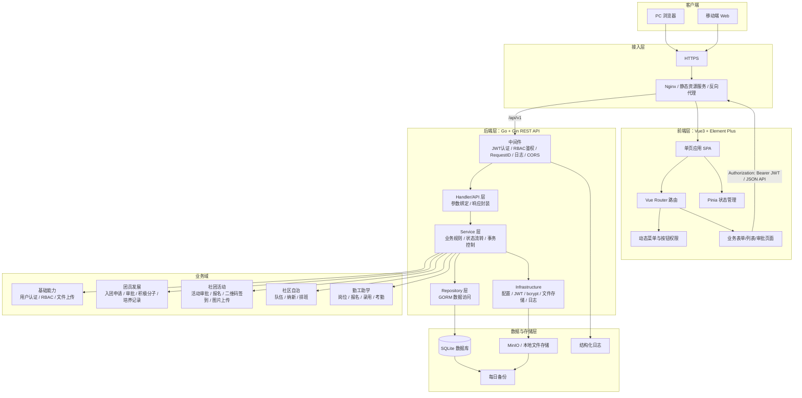
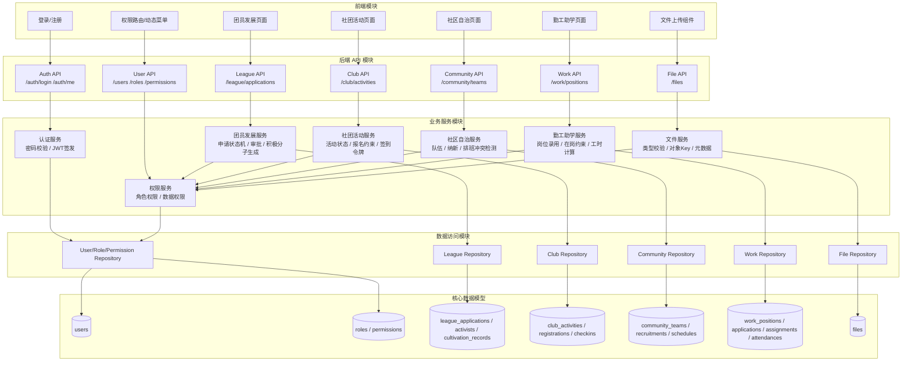
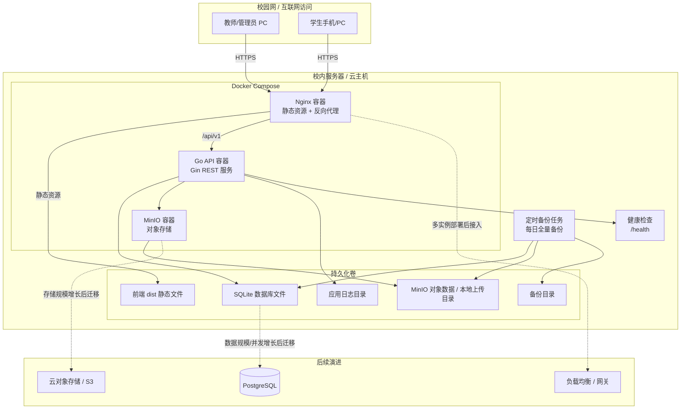
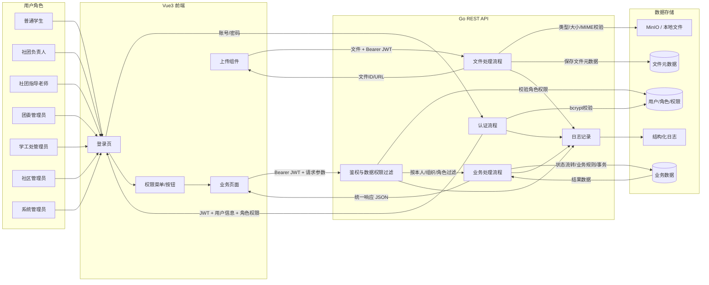
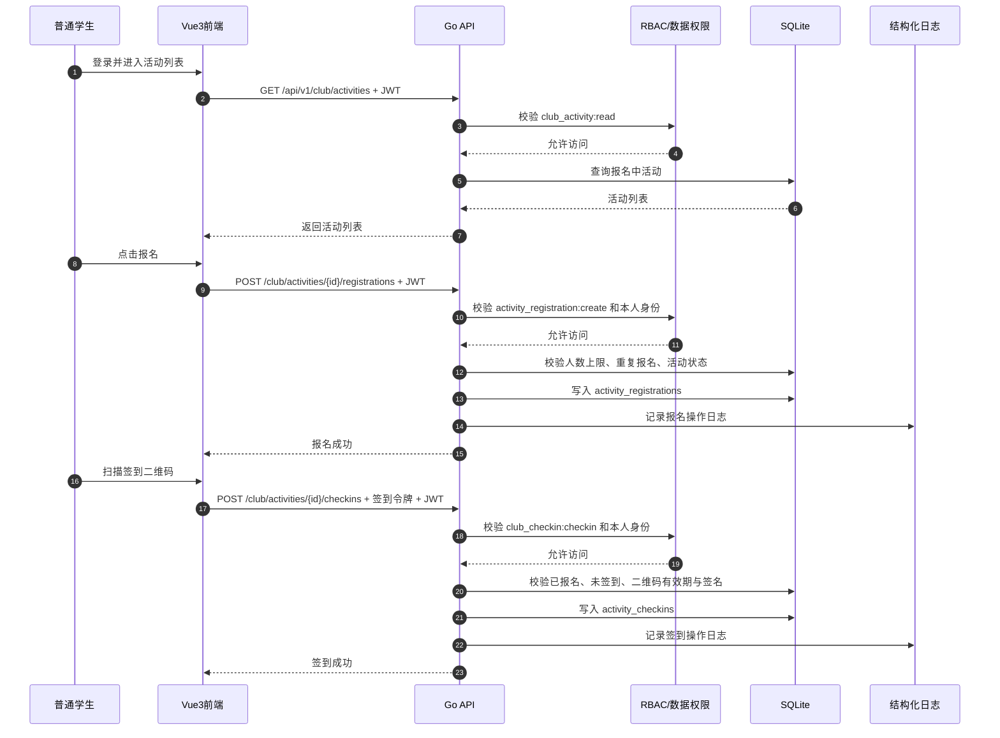
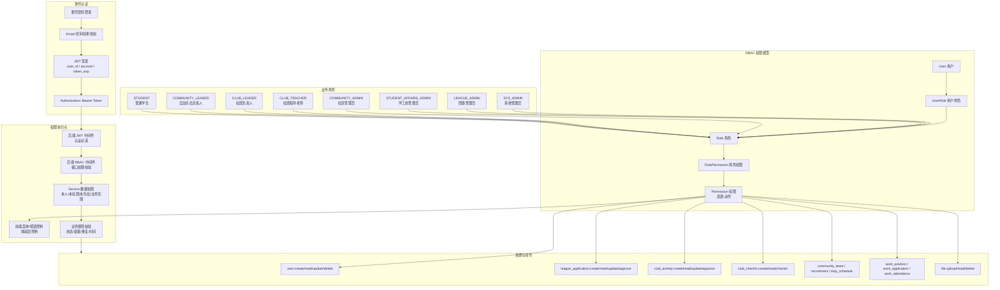
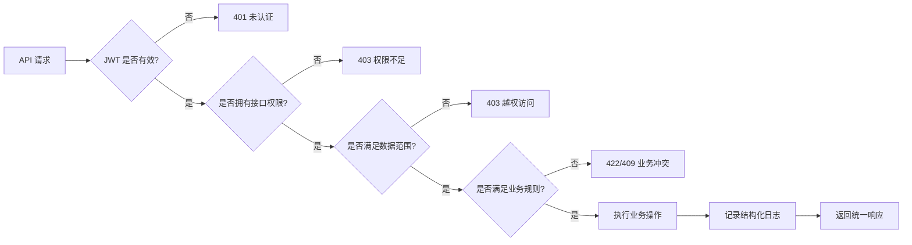

# 系统架构设计文档 — 学生“一站式”自主管理过程管理系统

> 文档版本：v1.0  
> 创建日期：2026-06-05  
> 输入文档：`02-prd.md`、`04-srd.md`、`docs/adr/`  
> 架构决策：Go + Gin、SQLite、Vue3 + Element Plus、JWT、前后端分离  

---

## 1. 架构原则

1. **前后端分离**：Vue3 前端负责页面、路由、权限菜单和交互；Go + Gin 后端负责认证、授权、业务规则和数据访问。
2. **模块化单体优先**：MVP 阶段采用模块化单体架构，按业务域划分模块，保留后续微服务拆分边界。
3. **后端强制鉴权**：前端只控制菜单和按钮展示，所有接口权限和数据权限均由后端校验。
4. **低成本部署**：MVP 使用 Docker Compose 单机部署，SQLite 单文件数据库，MinIO 或本地文件存储。
5. **可演进设计**：通过 Repository 层隔离数据库实现，通过 S3 兼容接口隔离文件存储，通过 Service 层隔离业务流程。
6. **安全默认开启**：密码哈希、JWT、RBAC、输入校验、文件白名单、结构化日志作为基础能力。

---

## 2. 系统架构图

---

## 3. 模块架构图

---

## 4. 部署架构图

---

## 5. 数据流图

### 5.1 典型业务数据流：社团活动报名与签到

---

## 6. 权限架构图

### 6.1 权限控制边界

---

## 7. 关键架构决策映射

| 决策项 | 当前方案 | 架构影响 |
|--------|----------|----------|
| 后端框架 | Go + Gin | 轻量 REST API、单二进制部署、适合模块化单体 |
| 数据库 | SQLite + GORM | MVP 零配置部署，Repository 层预留 PostgreSQL 迁移 |
| 前端 | Vue3 + Element Plus | 快速构建中后台页面，学生端通过响应式适配 |
| 认证 | JWT Bearer Token | 无状态认证，适合前后端分离和未来多端复用 |
| 总体架构 | 前后端分离 | 前端静态资源与后端 API 独立构建、独立部署 |
| 文件存储 | MinIO / 本地降级 | S3 兼容接口，后续可迁移云对象存储 |
| 权限模型 | RBAC + 数据权限 | 角色权限控制接口访问，服务端过滤本人/组织范围数据 |

---

## 8. 风险与演进方向

| 风险 | 影响 | 当前缓解措施 | 演进方向 |
|------|------|--------------|----------|
| SQLite 写并发瓶颈 | 报名、签到高峰可能出现锁竞争 | 控制事务范围、建立索引、避免长事务 | 迁移 PostgreSQL |
| JWT 主动失效较弱 | 用户禁用或权限变更无法立即完全生效 | 缩短有效期，后端实时查询关键权限 | 引入刷新令牌、Token 黑名单或 token_version |
| Element Plus 移动端体验有限 | 学生手机端表单和签到体验受限 | 响应式布局、简化移动端页面 | 引入移动端组件或小程序端 |
| 文件上传安全 | 恶意文件、越权访问、URL 泄露 | 白名单、随机对象Key、受控URL | 私有桶、临时签名URL、内容检测 |
| 审批规则变化 | 后续多级审批需求增加 | Service 层封装状态流转 | 抽象审批流引擎 |

---

## 9. 架构验收要点

1. 前端通过 `/api/v1` 调用后端 REST API，非公开接口必须携带 JWT。
2. 后端所有接口必须经过认证中间件、RBAC 校验和数据权限过滤。
3. 核心业务模块按 Handler / Service / Repository 分层实现。
4. 所有列表接口分页，关键外键、状态、时间字段建立索引。
5. 文件上传必须校验类型、大小、MIME，并保存文件元数据。
6. 关键操作必须记录结构化日志，日志不得包含密码、JWT 完整值和敏感配置。
7. SQLite 数据库文件、上传文件目录必须纳入每日备份。
8. 部署环境提供 `/health` 健康检查接口。
