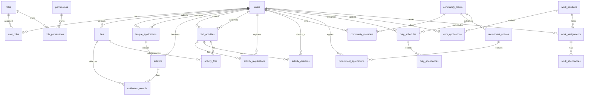

# 数据库设计文档 — 学生“一站式”自主管理过程管理系统

> 文档版本：v1.0  
> 创建日期：2026-06-05  
> 数据库：SQLite3  
> ORM：GORM  
> 输入文档：`docs/02-prd.md`、`docs/04-srd.md`、`docs/05-architecture.md`

---

## 1. 设计目标

本数据库设计面向 MVP 至增强阶段，覆盖基础能力、团员发展、社团活动、社区自治、勤工助学与文件管理六类数据域。

设计目标：

1. 支撑用户认证、JWT 登录、RBAC 权限与数据权限控制。
2. 支撑四大业务域核心流程线上闭环：申请、审批、报名、签到、排班、考勤。
3. 适配 SQLite3 单文件部署，同时通过 GORM 模型保持后续迁移 PostgreSQL 的可能性。
4. 通过主外键、唯一约束、检查约束和索引保证数据一致性与查询性能。
5. 所有核心业务数据保留创建时间、更新时间，关键表保留软删除字段。

---

## 2. 命名与建模规范

| 类型 | 规范 |
|------|------|
| 表名 | 小写蛇形复数，如 `league_applications` |
| 字段名 | 小写蛇形，如 `student_id`、`created_at` |
| 主键 | `id INTEGER PRIMARY KEY AUTOINCREMENT` |
| 外键 | `{实体}_id INTEGER NOT NULL`，使用 SQLite 外键约束 |
| 时间字段 | `DATETIME`，默认 `CURRENT_TIMESTAMP` |
| 金额字段 | `NUMERIC(10,2)`，避免浮点误差 |
| 枚举字段 | `TEXT` + `CHECK` 约束，存储稳定英文编码 |
| 软删除 | 需要保留历史的业务主表使用 `deleted_at DATETIME` |
| GORM | 可映射 `gorm.Model` 或显式 `ID/CreatedAt/UpdatedAt/DeletedAt` 字段 |

SQLite 初始化建议：

```sql
PRAGMA foreign_keys = ON;
PRAGMA journal_mode = WAL;
PRAGMA busy_timeout = 5000;
```

---

## 3. ER 图



---

## 4. 表清单

| 数据域 | 表名 | 说明 |
|--------|------|------|
| 基础能力 | `users` | 用户账号、学生/教师/管理员基础信息 |
| 基础能力 | `roles` | 角色定义 |
| 基础能力 | `permissions` | 权限定义 |
| 基础能力 | `user_roles` | 用户-角色关联 |
| 基础能力 | `role_permissions` | 角色-权限关联 |
| 文件管理 | `files` | 文件元数据 |
| 团员发展 | `league_applications` | 入团申请与审批 |
| 团员发展 | `activists` | 入团积极分子 |
| 团员发展 | `cultivation_records` | 培养记录/思想汇报/培训记录 |
| 社团活动 | `club_activities` | 社团活动策划与审批 |
| 社团活动 | `activity_registrations` | 活动报名 |
| 社团活动 | `activity_checkins` | 活动签到 |
| 社团活动 | `activity_files` | 活动附件/图片关联 |
| 社区自治 | `community_teams` | 自治队伍 |
| 社区自治 | `community_members` | 自治队伍成员 |
| 社区自治 | `recruitment_notices` | 纳新公告 |
| 社区自治 | `recruitment_applications` | 纳新报名 |
| 社区自治 | `duty_schedules` | 值班排班 |
| 社区自治 | `duty_attendances` | 值班出勤 |
| 勤工助学 | `work_positions` | 勤工岗位 |
| 勤工助学 | `work_applications` | 岗位报名 |
| 勤工助学 | `work_assignments` | 在岗关系 |
| 勤工助学 | `work_attendances` | 勤工考勤 |

---

## 5. 数据字典与表结构

### 5.1 基础能力

#### users 用户表

| 字段 | 类型 | 必填 | 约束 | 说明 |
|------|------|------|------|------|
| id | INTEGER | 是 | PK | 用户ID |
| account | TEXT | 是 | UNIQUE | 学号/工号/管理员账号 |
| name | TEXT | 是 | - | 姓名 |
| password_hash | TEXT | 是 | - | bcrypt 密码哈希 |
| user_type | TEXT | 是 | CHECK | `student`/`staff`/`admin` |
| department | TEXT | 否 | INDEX | 院系/部门 |
| grade | TEXT | 否 | INDEX | 年级 |
| phone | TEXT | 否 | - | 手机号 |
| email | TEXT | 否 | - | 邮箱 |
| status | TEXT | 是 | INDEX | `active`/`locked`/`disabled` |
| failed_login_count | INTEGER | 是 | DEFAULT 0 | 登录失败次数 |
| locked_until | DATETIME | 否 | - | 锁定截止时间 |
| last_login_at | DATETIME | 否 | - | 最近登录时间 |
| created_at | DATETIME | 是 | - | 创建时间 |
| updated_at | DATETIME | 是 | - | 更新时间 |
| deleted_at | DATETIME | 否 | INDEX | 软删除时间 |

#### roles 角色表

| 字段 | 类型 | 必填 | 约束 | 说明 |
|------|------|------|------|------|
| id | INTEGER | 是 | PK | 角色ID |
| code | TEXT | 是 | UNIQUE | 角色编码，如 `SYS_ADMIN` |
| name | TEXT | 是 | - | 角色名称 |
| description | TEXT | 否 | - | 角色说明 |
| created_at | DATETIME | 是 | - | 创建时间 |
| updated_at | DATETIME | 是 | - | 更新时间 |

#### permissions 权限表

| 字段 | 类型 | 必填 | 约束 | 说明 |
|------|------|------|------|------|
| id | INTEGER | 是 | PK | 权限ID |
| code | TEXT | 是 | UNIQUE | 权限编码，如 `club_activity:create` |
| name | TEXT | 是 | - | 权限名称 |
| resource | TEXT | 是 | INDEX | 资源编码 |
| action | TEXT | 是 | INDEX | 动作编码 |
| created_at | DATETIME | 是 | - | 创建时间 |
| updated_at | DATETIME | 是 | - | 更新时间 |

#### user_roles 用户角色关联表

| 字段 | 类型 | 必填 | 约束 | 说明 |
|------|------|------|------|------|
| user_id | INTEGER | 是 | PK, FK | 用户ID |
| role_id | INTEGER | 是 | PK, FK | 角色ID |
| created_at | DATETIME | 是 | - | 分配时间 |

#### role_permissions 角色权限关联表

| 字段 | 类型 | 必填 | 约束 | 说明 |
|------|------|------|------|------|
| role_id | INTEGER | 是 | PK, FK | 角色ID |
| permission_id | INTEGER | 是 | PK, FK | 权限ID |
| created_at | DATETIME | 是 | - | 授权时间 |

### 5.2 文件管理

#### files 文件元数据表

| 字段 | 类型 | 必填 | 约束 | 说明 |
|------|------|------|------|------|
| id | INTEGER | 是 | PK | 文件ID |
| original_name | TEXT | 是 | - | 原始文件名 |
| object_key | TEXT | 是 | UNIQUE | 对象存储Key或本地路径Key |
| bucket | TEXT | 是 | - | 存储桶/目录 |
| content_type | TEXT | 是 | - | MIME 类型 |
| size | INTEGER | 是 | CHECK | 文件大小，Byte |
| url | TEXT | 是 | - | 访问URL |
| biz_type | TEXT | 是 | INDEX | 业务类型 |
| uploaded_by | INTEGER | 是 | FK | 上传用户 |
| created_at | DATETIME | 是 | - | 上传时间 |
| deleted_at | DATETIME | 否 | INDEX | 软删除时间 |

### 5.3 团员发展

#### league_applications 入团申请表

| 字段 | 类型 | 必填 | 约束 | 说明 |
|------|------|------|------|------|
| id | INTEGER | 是 | PK | 申请ID |
| student_id | INTEGER | 是 | FK, INDEX | 申请学生 |
| reason | TEXT | 是 | - | 申请理由 |
| resume | TEXT | 否 | - | 个人简历 |
| status | TEXT | 是 | CHECK, INDEX | `draft`/`pending`/`approved`/`rejected` |
| approval_opinion | TEXT | 否 | - | 审批意见 |
| approved_by | INTEGER | 否 | FK | 审批人 |
| approved_at | DATETIME | 否 | - | 审批时间 |
| created_at | DATETIME | 是 | - | 创建时间 |
| updated_at | DATETIME | 是 | - | 更新时间 |
| deleted_at | DATETIME | 否 | INDEX | 软删除时间 |

业务约束：同一学生仅允许一条非删除且非驳回的有效申请。

#### activists 积极分子表

| 字段 | 类型 | 必填 | 约束 | 说明 |
|------|------|------|------|------|
| id | INTEGER | 是 | PK | 积极分子ID |
| student_id | INTEGER | 是 | FK, UNIQUE | 学生ID |
| application_id | INTEGER | 是 | FK, UNIQUE | 来源申请 |
| status | TEXT | 是 | CHECK, INDEX | `cultivating`/`developed`/`eliminated` |
| registered_date | DATE | 是 | - | 登记日期 |
| status_reason | TEXT | 否 | - | 状态变更原因 |
| created_at | DATETIME | 是 | - | 创建时间 |
| updated_at | DATETIME | 是 | - | 更新时间 |
| deleted_at | DATETIME | 否 | INDEX | 软删除时间 |

#### cultivation_records 培养记录表

| 字段 | 类型 | 必填 | 约束 | 说明 |
|------|------|------|------|------|
| id | INTEGER | 是 | PK | 记录ID |
| activist_id | INTEGER | 是 | FK, INDEX | 积极分子ID |
| record_type | TEXT | 是 | CHECK, INDEX | `thought_report`/`training`/`practice`/`review` |
| content | TEXT | 是 | - | 记录内容 |
| file_id | INTEGER | 否 | FK | 附件ID |
| status | TEXT | 是 | CHECK, INDEX | `pending`/`confirmed` |
| created_by | INTEGER | 是 | FK | 创建人 |
| confirmed_by | INTEGER | 否 | FK | 确认人 |
| confirmed_at | DATETIME | 否 | - | 确认时间 |
| created_at | DATETIME | 是 | - | 创建时间 |
| updated_at | DATETIME | 是 | - | 更新时间 |

### 5.4 社团活动

#### club_activities 活动表

| 字段 | 类型 | 必填 | 约束 | 说明 |
|------|------|------|------|------|
| id | INTEGER | 是 | PK | 活动ID |
| club_name | TEXT | 是 | INDEX | 社团名称 |
| title | TEXT | 是 | INDEX | 活动标题 |
| start_time | DATETIME | 是 | INDEX | 开始时间 |
| end_time | DATETIME | 是 | INDEX | 结束时间 |
| location | TEXT | 是 | - | 活动地点 |
| capacity | INTEGER | 是 | CHECK | 人数上限 |
| description | TEXT | 是 | - | 活动描述 |
| budget | NUMERIC(10,2) | 否 | CHECK | 预算 |
| status | TEXT | 是 | CHECK, INDEX | 活动状态 |
| approval_opinion | TEXT | 否 | - | 审批意见 |
| created_by | INTEGER | 是 | FK | 创建人 |
| approved_by | INTEGER | 否 | FK | 审批人 |
| approved_at | DATETIME | 否 | - | 审批时间 |
| created_at | DATETIME | 是 | - | 创建时间 |
| updated_at | DATETIME | 是 | - | 更新时间 |
| deleted_at | DATETIME | 否 | INDEX | 软删除时间 |

#### activity_registrations 活动报名表

| 字段 | 类型 | 必填 | 约束 | 说明 |
|------|------|------|------|------|
| id | INTEGER | 是 | PK | 报名ID |
| activity_id | INTEGER | 是 | FK, INDEX | 活动ID |
| student_id | INTEGER | 是 | FK, INDEX | 学生ID |
| status | TEXT | 是 | CHECK, INDEX | `registered`/`cancelled` |
| registered_at | DATETIME | 是 | - | 报名时间 |
| cancelled_at | DATETIME | 否 | - | 取消时间 |
| created_at | DATETIME | 是 | - | 创建时间 |
| updated_at | DATETIME | 是 | - | 更新时间 |

唯一约束：`UNIQUE(activity_id, student_id)`。

#### activity_checkins 活动签到表

| 字段 | 类型 | 必填 | 约束 | 说明 |
|------|------|------|------|------|
| id | INTEGER | 是 | PK | 签到ID |
| activity_id | INTEGER | 是 | FK, INDEX | 活动ID |
| student_id | INTEGER | 是 | FK, INDEX | 学生ID |
| checkin_time | DATETIME | 是 | INDEX | 签到时间 |
| checkin_method | TEXT | 是 | CHECK | `qr`/`manual` |
| created_at | DATETIME | 是 | - | 创建时间 |

唯一约束：`UNIQUE(activity_id, student_id)`。

#### activity_files 活动文件关联表

| 字段 | 类型 | 必填 | 约束 | 说明 |
|------|------|------|------|------|
| id | INTEGER | 是 | PK | 关联ID |
| activity_id | INTEGER | 是 | FK, INDEX | 活动ID |
| file_id | INTEGER | 是 | FK, INDEX | 文件ID |
| file_type | TEXT | 是 | CHECK | `image`/`document`/`summary` |
| created_at | DATETIME | 是 | - | 创建时间 |

### 5.5 社区自治

#### community_teams 自治队伍表

| 字段 | 类型 | 必填 | 约束 | 说明 |
|------|------|------|------|------|
| id | INTEGER | 是 | PK | 队伍ID |
| name | TEXT | 是 | UNIQUE | 队伍名称 |
| area | TEXT | 否 | INDEX | 所属区域 |
| description | TEXT | 否 | - | 队伍说明 |
| leader_id | INTEGER | 否 | FK | 负责人 |
| status | TEXT | 是 | CHECK, INDEX | `active`/`inactive` |
| created_at | DATETIME | 是 | - | 创建时间 |
| updated_at | DATETIME | 是 | - | 更新时间 |
| deleted_at | DATETIME | 否 | INDEX | 软删除时间 |

#### community_members 队伍成员表

| 字段 | 类型 | 必填 | 约束 | 说明 |
|------|------|------|------|------|
| id | INTEGER | 是 | PK | 成员记录ID |
| team_id | INTEGER | 是 | FK, INDEX | 队伍ID |
| user_id | INTEGER | 是 | FK, INDEX | 用户ID |
| role | TEXT | 是 | CHECK | `leader`/`member` |
| joined_at | DATETIME | 是 | - | 加入时间 |
| status | TEXT | 是 | CHECK, INDEX | `active`/`left` |
| created_at | DATETIME | 是 | - | 创建时间 |
| updated_at | DATETIME | 是 | - | 更新时间 |

唯一约束：`UNIQUE(team_id, user_id)`。

#### recruitment_notices 纳新公告表

| 字段 | 类型 | 必填 | 约束 | 说明 |
|------|------|------|------|------|
| id | INTEGER | 是 | PK | 公告ID |
| team_id | INTEGER | 是 | FK, INDEX | 队伍ID |
| title | TEXT | 是 | - | 纳新标题 |
| requirements | TEXT | 否 | - | 招募要求 |
| quota | INTEGER | 是 | CHECK | 招募人数 |
| deadline | DATETIME | 是 | INDEX | 截止时间 |
| status | TEXT | 是 | CHECK, INDEX | `draft`/`published`/`closed` |
| created_by | INTEGER | 是 | FK | 发布人 |
| created_at | DATETIME | 是 | - | 创建时间 |
| updated_at | DATETIME | 是 | - | 更新时间 |
| deleted_at | DATETIME | 否 | INDEX | 软删除时间 |

#### recruitment_applications 纳新报名表

| 字段 | 类型 | 必填 | 约束 | 说明 |
|------|------|------|------|------|
| id | INTEGER | 是 | PK | 报名ID |
| notice_id | INTEGER | 是 | FK, INDEX | 纳新公告ID |
| student_id | INTEGER | 是 | FK, INDEX | 学生ID |
| statement | TEXT | 否 | - | 报名说明 |
| status | TEXT | 是 | CHECK, INDEX | `pending`/`approved`/`rejected` |
| review_opinion | TEXT | 否 | - | 审核意见 |
| reviewed_by | INTEGER | 否 | FK | 审核人 |
| reviewed_at | DATETIME | 否 | - | 审核时间 |
| created_at | DATETIME | 是 | - | 创建时间 |
| updated_at | DATETIME | 是 | - | 更新时间 |

唯一约束：`UNIQUE(notice_id, student_id)`。

#### duty_schedules 值班排班表

| 字段 | 类型 | 必填 | 约束 | 说明 |
|------|------|------|------|------|
| id | INTEGER | 是 | PK | 排班ID |
| team_id | INTEGER | 是 | FK, INDEX | 队伍ID |
| user_id | INTEGER | 是 | FK, INDEX | 值班人员 |
| duty_date | DATE | 是 | INDEX | 值班日期 |
| time_slot | TEXT | 是 | INDEX | 时间段编码 |
| start_time | DATETIME | 是 | - | 开始时间 |
| end_time | DATETIME | 是 | - | 结束时间 |
| status | TEXT | 是 | CHECK, INDEX | `scheduled`/`completed`/`absent`/`cancelled` |
| created_by | INTEGER | 是 | FK | 创建人 |
| created_at | DATETIME | 是 | - | 创建时间 |
| updated_at | DATETIME | 是 | - | 更新时间 |

唯一约束：`UNIQUE(user_id, duty_date, time_slot)`。

#### duty_attendances 值班出勤表

| 字段 | 类型 | 必填 | 约束 | 说明 |
|------|------|------|------|------|
| id | INTEGER | 是 | PK | 出勤ID |
| schedule_id | INTEGER | 是 | FK, UNIQUE | 排班ID |
| user_id | INTEGER | 是 | FK, INDEX | 出勤人员 |
| attendance_status | TEXT | 是 | CHECK, INDEX | `present`/`absent`/`leave` |
| hours | NUMERIC(5,2) | 是 | CHECK | 志愿/值班时长 |
| remark | TEXT | 否 | - | 备注 |
| confirmed_by | INTEGER | 否 | FK | 确认人 |
| confirmed_at | DATETIME | 否 | - | 确认时间 |
| created_at | DATETIME | 是 | - | 创建时间 |
| updated_at | DATETIME | 是 | - | 更新时间 |

### 5.6 勤工助学

#### work_positions 勤工岗位表

| 字段 | 类型 | 必填 | 约束 | 说明 |
|------|------|------|------|------|
| id | INTEGER | 是 | PK | 岗位ID |
| title | TEXT | 是 | INDEX | 岗位名称 |
| department | TEXT | 是 | INDEX | 用工部门 |
| quota | INTEGER | 是 | CHECK | 招聘人数 |
| salary | NUMERIC(10,2) | 是 | CHECK | 薪资/补贴标准 |
| salary_unit | TEXT | 是 | CHECK | `hour`/`month`/`task` |
| requirements | TEXT | 否 | - | 岗位要求 |
| work_time | TEXT | 否 | - | 工作时间说明 |
| deadline | DATETIME | 否 | INDEX | 报名截止时间 |
| status | TEXT | 是 | CHECK, INDEX | `open`/`closed`/`archived` |
| created_by | INTEGER | 是 | FK | 发布人 |
| created_at | DATETIME | 是 | - | 创建时间 |
| updated_at | DATETIME | 是 | - | 更新时间 |
| deleted_at | DATETIME | 否 | INDEX | 软删除时间 |

#### work_applications 岗位报名表

| 字段 | 类型 | 必填 | 约束 | 说明 |
|------|------|------|------|------|
| id | INTEGER | 是 | PK | 报名ID |
| position_id | INTEGER | 是 | FK, INDEX | 岗位ID |
| student_id | INTEGER | 是 | FK, INDEX | 学生ID |
| statement | TEXT | 否 | - | 申请说明 |
| status | TEXT | 是 | CHECK, INDEX | `pending`/`approved`/`rejected`/`cancelled` |
| review_opinion | TEXT | 否 | - | 审核意见 |
| reviewed_by | INTEGER | 否 | FK | 审核人 |
| reviewed_at | DATETIME | 否 | - | 审核时间 |
| created_at | DATETIME | 是 | - | 创建时间 |
| updated_at | DATETIME | 是 | - | 更新时间 |

唯一约束：`UNIQUE(position_id, student_id)`。

#### work_assignments 在岗关系表

| 字段 | 类型 | 必填 | 约束 | 说明 |
|------|------|------|------|------|
| id | INTEGER | 是 | PK | 在岗记录ID |
| position_id | INTEGER | 是 | FK, INDEX | 岗位ID |
| student_id | INTEGER | 是 | FK, INDEX | 学生ID |
| application_id | INTEGER | 否 | FK | 来源报名 |
| start_date | DATE | 是 | - | 上岗日期 |
| end_date | DATE | 否 | - | 离岗日期 |
| status | TEXT | 是 | CHECK, INDEX | `active`/`ended` |
| created_at | DATETIME | 是 | - | 创建时间 |
| updated_at | DATETIME | 是 | - | 更新时间 |

业务约束：同一学生仅允许一个 `active` 在岗关系，通过 SQLite 部分唯一索引实现。

#### work_attendances 勤工考勤表

| 字段 | 类型 | 必填 | 约束 | 说明 |
|------|------|------|------|------|
| id | INTEGER | 是 | PK | 考勤ID |
| assignment_id | INTEGER | 是 | FK, INDEX | 在岗关系ID |
| work_date | DATE | 是 | INDEX | 工作日期 |
| clock_in_at | DATETIME | 否 | - | 上班打卡时间 |
| clock_out_at | DATETIME | 否 | - | 下班打卡时间 |
| hours | NUMERIC(5,2) | 是 | CHECK | 工时 |
| status | TEXT | 是 | CHECK, INDEX | `normal`/`exception`/`adjusted` |
| exception_type | TEXT | 否 | CHECK | `late`/`early_leave`/`missing_clock`/`other` |
| adjusted_by | INTEGER | 否 | FK | 调整人 |
| remark | TEXT | 否 | - | 备注 |
| created_at | DATETIME | 是 | - | 创建时间 |
| updated_at | DATETIME | 是 | - | 更新时间 |

唯一约束：`UNIQUE(assignment_id, work_date)`。

---

## 6. 主外键设计

### 6.1 主键设计

| 规则 | 说明 |
|------|------|
| 单表主键 | 业务主表统一使用 `id INTEGER PRIMARY KEY AUTOINCREMENT` |
| 关联表主键 | `user_roles`、`role_permissions` 使用联合主键，避免重复授权 |
| 业务关联表 | 报名、签到、成员、排班等表使用自增主键 + 唯一业务约束 |

### 6.2 外键设计

| 从表 | 字段 | 主表 | 删除策略 |
|------|------|------|----------|
| user_roles | user_id | users.id | CASCADE |
| user_roles | role_id | roles.id | CASCADE |
| role_permissions | role_id | roles.id | CASCADE |
| role_permissions | permission_id | permissions.id | CASCADE |
| files | uploaded_by | users.id | RESTRICT |
| league_applications | student_id | users.id | RESTRICT |
| league_applications | approved_by | users.id | SET NULL |
| activists | student_id | users.id | RESTRICT |
| activists | application_id | league_applications.id | RESTRICT |
| cultivation_records | activist_id | activists.id | CASCADE |
| cultivation_records | file_id | files.id | SET NULL |
| club_activities | created_by | users.id | RESTRICT |
| club_activities | approved_by | users.id | SET NULL |
| activity_registrations | activity_id | club_activities.id | CASCADE |
| activity_registrations | student_id | users.id | RESTRICT |
| activity_checkins | activity_id | club_activities.id | CASCADE |
| activity_checkins | student_id | users.id | RESTRICT |
| activity_files | activity_id | club_activities.id | CASCADE |
| activity_files | file_id | files.id | RESTRICT |
| community_teams | leader_id | users.id | SET NULL |
| community_members | team_id | community_teams.id | CASCADE |
| community_members | user_id | users.id | RESTRICT |
| recruitment_notices | team_id | community_teams.id | CASCADE |
| recruitment_applications | notice_id | recruitment_notices.id | CASCADE |
| duty_schedules | team_id | community_teams.id | CASCADE |
| duty_attendances | schedule_id | duty_schedules.id | CASCADE |
| work_positions | created_by | users.id | RESTRICT |
| work_applications | position_id | work_positions.id | CASCADE |
| work_assignments | position_id | work_positions.id | RESTRICT |
| work_attendances | assignment_id | work_assignments.id | CASCADE |

---

## 7. 索引设计

### 7.1 索引原则

1. 所有外键字段建立索引。
2. 高频筛选字段建立普通索引：`status`、`department`、`grade`、`biz_type`。
3. 高频列表排序字段建立索引：`created_at`、`start_time`、`deadline`、`work_date`。
4. 业务唯一性通过唯一索引保证，避免仅依赖应用层校验。
5. SQLite 支持部分索引，用于“同一学生仅一个有效状态”的约束。

### 7.2 唯一索引

| 索引 | 表 | 字段 | 目的 |
|------|----|------|------|
| ux_users_account | users | account | 账号唯一 |
| ux_roles_code | roles | code | 角色编码唯一 |
| ux_permissions_code | permissions | code | 权限编码唯一 |
| ux_user_roles | user_roles | user_id, role_id | 防止重复角色 |
| ux_role_permissions | role_permissions | role_id, permission_id | 防止重复授权 |
| ux_files_object_key | files | object_key | 文件对象唯一 |
| ux_activists_student | activists | student_id | 学生积极分子记录唯一 |
| ux_activists_application | activists | application_id | 一条申请只生成一个积极分子 |
| ux_activity_registrations | activity_registrations | activity_id, student_id | 每活动每人只报名一次 |
| ux_activity_checkins | activity_checkins | activity_id, student_id | 每活动每人只签到一次 |
| ux_community_teams_name | community_teams | name | 队伍名称唯一 |
| ux_community_members | community_members | team_id, user_id | 队伍成员唯一 |
| ux_recruitment_applications | recruitment_applications | notice_id, student_id | 每公告每人只报名一次 |
| ux_duty_schedules_user_slot | duty_schedules | user_id, duty_date, time_slot | 避免排班冲突 |
| ux_work_applications | work_applications | position_id, student_id | 每岗位每人只报名一次 |
| ux_work_assignments_active_student | work_assignments | student_id WHERE status='active' | 每学生仅一个在岗岗位 |
| ux_work_attendances | work_attendances | assignment_id, work_date | 每日在岗考勤唯一 |

### 7.3 查询索引

| 表 | 索引字段 | 支撑查询 |
|----|----------|----------|
| users | user_type, status | 用户管理筛选 |
| users | department, grade | 学生按院系/年级筛选 |
| permissions | resource, action | 权限资源查询 |
| files | biz_type, uploaded_by, created_at | 文件列表与业务附件查询 |
| league_applications | student_id, status, created_at | 我的申请、待审批列表 |
| cultivation_records | activist_id, record_type, status | 培养记录时间线 |
| club_activities | status, start_time | 活动列表、活动日程 |
| club_activities | club_name, created_by | 社团负责人活动管理 |
| activity_registrations | student_id, status | 我的报名 |
| activity_checkins | activity_id, checkin_time | 活动签到统计 |
| community_teams | area, status | 队伍列表筛选 |
| recruitment_notices | team_id, status, deadline | 纳新公告列表 |
| duty_schedules | team_id, duty_date | 队伍排班日历 |
| duty_schedules | user_id, duty_date | 个人排班查询 |
| work_positions | department, status, deadline | 岗位列表筛选 |
| work_applications | student_id, status | 我的岗位报名 |
| work_assignments | student_id, status | 在岗关系查询 |
| work_attendances | assignment_id, work_date | 月度考勤统计 |

---

## 8. GORM 映射建议

### 8.1 基础模型

```go
type BaseModel struct {
    ID        uint           `gorm:"primaryKey"`
    CreatedAt time.Time
    UpdatedAt time.Time
    DeletedAt gorm.DeletedAt `gorm:"index"`
}
```

对于不需要软删除的关联表，可不嵌入 `DeletedAt`。

### 8.2 SQLite 注意事项

1. 连接建立后必须执行 `PRAGMA foreign_keys = ON`，否则 SQLite 默认不强制外键。
2. 建议启用 WAL：`PRAGMA journal_mode = WAL`，提升并发读取能力。
3. GORM `AutoMigrate` 可创建表结构，但复杂约束、部分索引建议通过 `sql/init.sql` 或迁移脚本显式管理。
4. `NUMERIC(10,2)` 在 SQLite 中属于 NUMERIC affinity，应用层仍需使用整数分或 decimal 类型避免精度问题。
5. `CHECK` 约束用于枚举兜底，业务层仍应做枚举校验。

---

## 9. 初始化脚本

初始化脚本见：`sql/init.sql`。

脚本内容包括：

1. SQLite PRAGMA 设置。
2. 所有业务表 `CREATE TABLE IF NOT EXISTS`。
3. 外键约束、检查约束、唯一约束。
4. 高频查询索引与部分唯一索引。
5. MVP 默认角色与权限种子数据。
